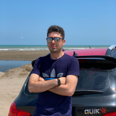
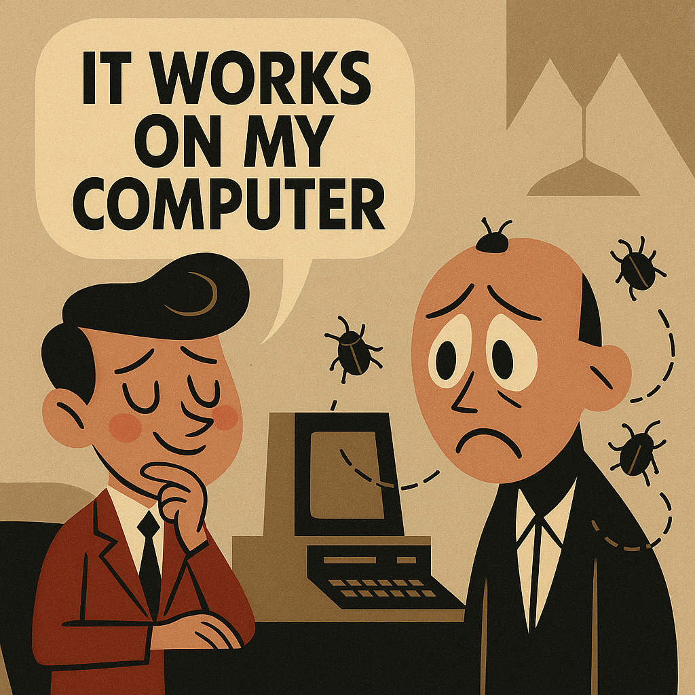

<!-- _class: lead -->

# Advanced Programming

**Lecturer:** Ali Najimi  
**Author:** Hossein Masihi  
**Faculty of Computer Engineering**  
**Sharif University of Technology**  
**Fall 2025**

---

# Table of Contents

1. Course Overview  
2. Course Structure & Grading  
3. Project Phases  
4. Assignments & Workshops  
5. TA Structure  
6. Course Rules & Collaboration  
7. Platforms & Communication  
8. Schedule & Timeline  
9. Instructor & Team  
10. Thank You 🙌  

---

# Course Overview

* Strengthen understanding of **software design, implementation, and analysis**.
* Main topics:
  * Object-Oriented Programming (OOP)
  * Multithreading & Concurrency
  * Networking & System Interaction
  * Software Testing & Design Patterns
* Focus on industrial workflow, collaboration, and real-world problem-solving.

---

# Course Structure & Grading

| Component       | Score       | Description                                                  |
| --------------- | ------------ | ------------------------------------------------------------ |
| **Project**     | 8 + 3 bonus  | Team project selected from a shared pool; bonus for outstanding results |
| **Assignments** | 6 + 1 bonus  | Five exercises, from Java basics to advanced concepts; bonus for early submissions |
| **Exams**       | 4 + 2        | Two written exams (Midterm & Final); higher one counts more |
| **Workshops**   | —            | No direct grade; attending workshops is required to earn exercise points |

**Note:**  
Workshops are designed to ensure you understand and complete exercises properly.  
Active participation helps unlock full assignment scores.

---

# Project Phases

* Teams select a **unique project** from a shared topic pool.
* Topics are distributed based on a ranked priority list.
* Roles:
  * **Product Owner:** manages project topics and mentors Product Managers.
  * **Product Manager:** prepares documentation and assists student teams.
* Weekly meetings ensure feedback, tracking, and mentoring.

---

# Assignments & Workshops

* **Five Assignments**
  * Ex0 – Java Introduction  
  * Ex1 – OOP Basics  
  * Ex2 – Inheritance, Interfaces, Testing  
  * Ex3 – Files, Streams, Concurrency  
  * Ex4 – Advanced Topics & Patterns  
* **Workshops**
  * Provide hands-on sessions aligned with assignments.
  * Attendance is required for assignment credit.
  * 4–6 sessions across the term.

---

# TA Structure

* **Head TA:** Coordinates all teaching assistants.  
* **Project TAs:** Mentor project teams and track deliverables.  
* **Assignment TAs:** Design and grade exercises.  
* **Workshop TAs:** Host practical sessions and labs.  
* **Exam TAs:** Prepare, review, and monitor exams.  

---

# Course Rules & Collaboration

* **Team Projects:** 3 students per team (4 in special cases).  
* All members must contribute equally.  
* Non-participating members receive **zero** for the project.  
* **AI tools** are allowed but explanations must be provided during defense.  
* **Delays:** Maximum 5 days → -10% per day after deadline.  
* **Extensions:** Allowed with prior collective approval.  
* **Emergencies:** Flexible deadlines upon proof.

---

# Platforms & Communication

* The course is active on:  
  **Quera**, **Bale**, **Telegram**, and the **<a href="https://14041.sharif-ap.ir">Course Website</a>**.
  
* Announcements, materials, and grades are published on these platforms.  
* Official communication via **course email** and **Bale group**.

---

# Instructor & Team

* **Lecturer:** Ali Najimi  
  * B.Sc. in Computer Engineering – IT, Sharif University of Technology  
  * M.B.A. (Strategy) – University of Tehran  
* **Head TA:** Sohaib Sadeghy  
  * CE1402
* **Slide Author:** Hossein Masihi  
  * CE1401
* **Course Team:** Committed to academic and technical excellence.  

  

    
  

---

# Thank You 🙌

**Good luck and enjoy Advanced Programming!**

> “It works on my machine.” — The first lie every programmer tells.  
> *And remember:* our instructor may not have a PhD…  
> **but he debugs faster than any PhD ever could. 🧠💻**

  

  

*Advanced Programming – Fall 2025 – Sharif University of Technology*

---

<!-- _class: lead -->
# 🎬 End of Presentation

<video height=400 style="" controls>
  <source src="assets/00/final-clip.mp4" type="video/mp4">
  Your browser does not support the video tag.
</video>

