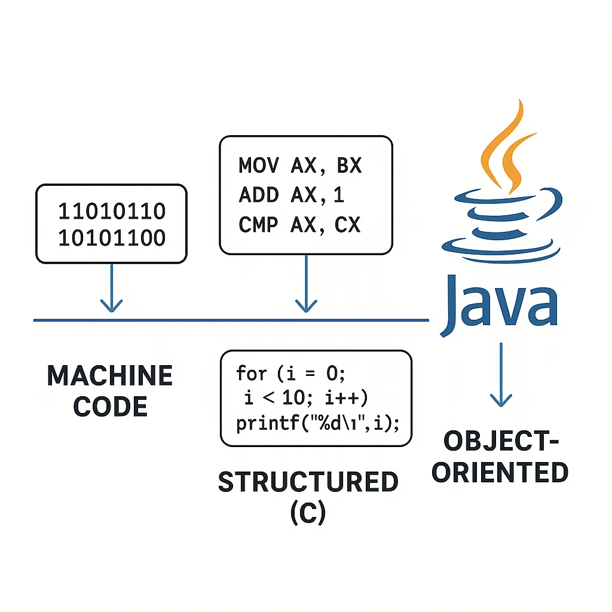
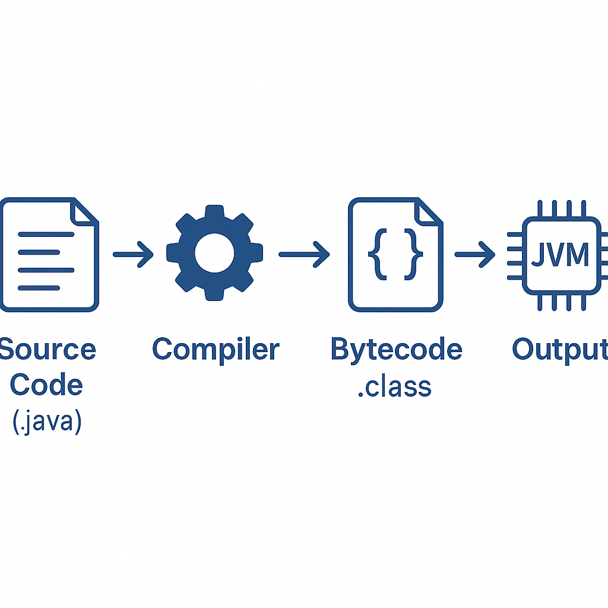
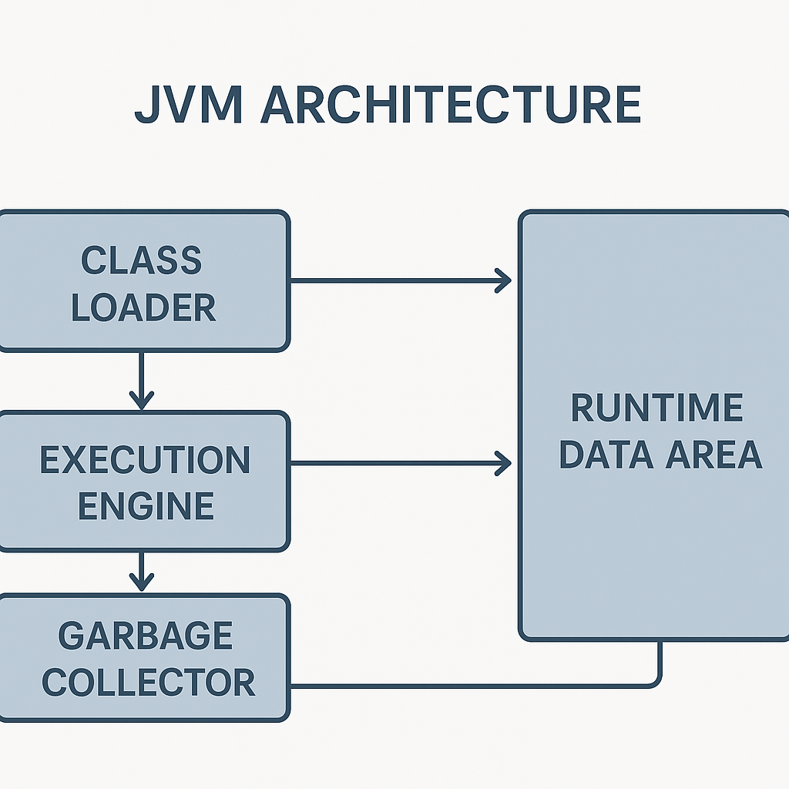
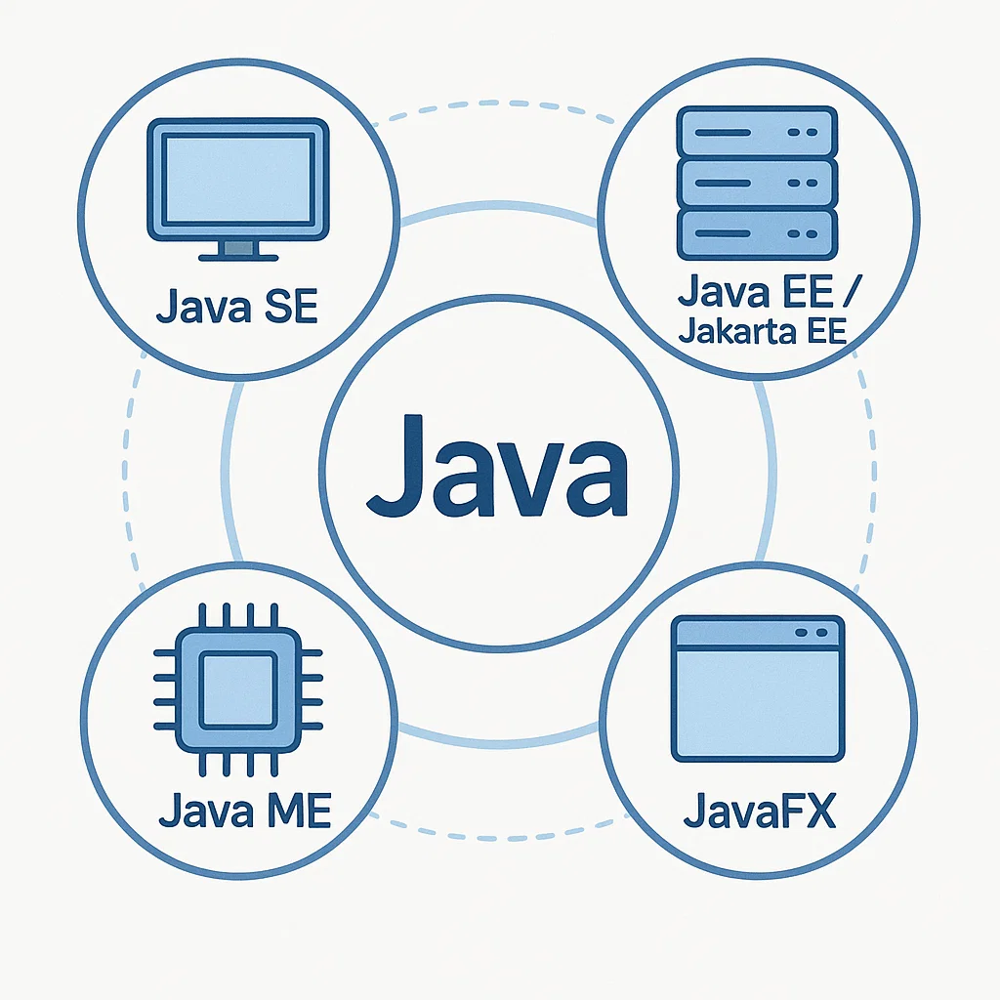
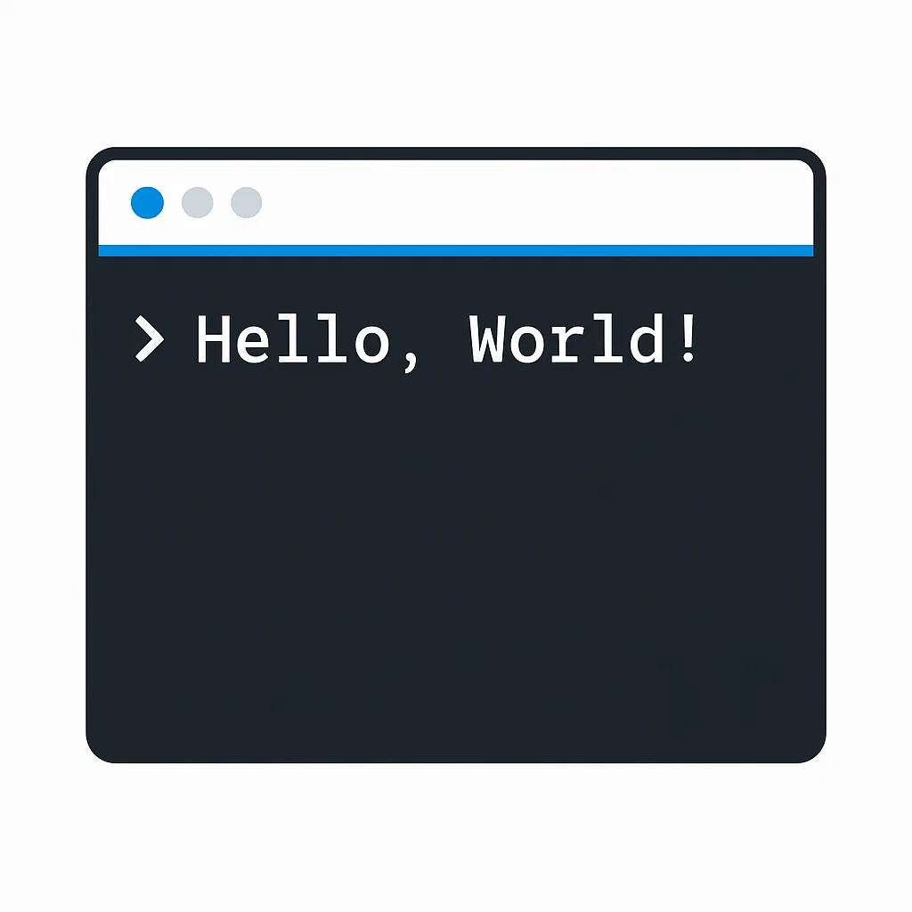

<!-- _class: lead -->


# Advanced Programming
## Java Introduction

**Lecturer:** Ali Najimi  
**Author:** Hossein Masihi  
**Faculty of Computer Engineering**  
**Sharif University of Technology**  
**Fall 2025**

---

# Table of Contents

1. Programming History  
2. What is Java?  
3. JVM (Java Virtual Machine)  
4. Java Versions  
5. Platforms  
6. Executables & Extensions  
7. Popularity & Usage  
8. Frameworks & Tooling  
9. Why Java?  
10. Hello World!

---

## Programming History

<div class="cols">
<div>

* Early languages: **Machine → Assembly → Structured → OOP**
* Machine & Assembly were hardware-dependent.
* Structured Programming (C) introduced functions & flow control.
* Object-Oriented Programming (Java, C++) introduced **classes** & **objects**.
* Java emerged in **1995** by *James Gosling* (Sun Microsystems).

</div>
<div>
  <div class="imgbox">



  </div>
</div>
</div>

---

## What is Java?

<div class="cols">
<div>

* High-level, Object-Oriented, Platform-Independent language.
* Source code compiled to **Bytecode**, executed by JVM.
* Motto: “**Write Once, Run Anywhere**.”
* Designed for portability, reliability, and security.

</div>
<div>
  <div class="imgbox">



  </div>
</div>
</div>

---

## JVM (Java Virtual Machine)

<div class="cols">
<div>

* JVM converts bytecode → machine instructions.
* Provides abstraction from underlying hardware.
* Components:
  * Class Loader
  * Execution Engine
  * Garbage Collector
* Enables the same code to run across Windows, Linux, and macOS.

</div>
<div>
  <div class="imgbox">



  </div>
</div>
</div>

---

## Java Versions

* **Java 1.0 (1995)** – initial release  
* **Java 5 (2004)** – generics & annotations  
* **Java 8 (2014)** – LTS, introduced lambdas  
* **Java 11 (2018)** – LTS, modern baseline  
* **Java 17 (2021)** – LTS, sealed classes & records  
* **Java 21 (2023)** – LTS, virtual threads  
* **Java 25 (2025)** – LTS, pattern matching enhancements  

---

<style>
  .timeline-grid {
    display: grid;
    grid-template-columns: repeat(7, 1fr);
    gap: 18px;
    align-items: start;
    position: relative;
    margin-top: 36px;
    padding-top: 18px;
  }
  .timeline-grid::before {
    content: "";
    position: absolute;
    top: 30px;
    left: 0;
    right: 0;
    height: 4px;
    background: #1966ab;
    opacity: 0.9;
  }
  .point {
    text-align: center;
    position: relative;
  }
  .circle {
    width: 22px;
    height: 22px;
    border: 3px solid #1966ab;
    background: #fff;
    border-radius: 50%;
    margin: 0 auto 8px;
    position: relative;
    z-index: 1;
  }
  .point h3 {
    color: #1966ab;
    margin: 6px 0 2px;
    font-size: 22px;
    line-height: 1.1;
  }
  .point p {
    margin: 0;
    font-size: 16px;
  }
</style>

<div class="timeline-grid">
  <div class="point">
    <div class="circle"></div>
    <h3>Java 1.0</h3>
    <p>1995 • Initial</p>
  </div>
  <div class="point">
    <div class="circle"></div>
    <h3>Java 5</h3>
    <p>2004 • Generics</p>
  </div>
  <div class="point">
    <div class="circle"></div>
    <h3>Java 8</h3>
    <p>2014 • LTS</p>
  </div>
  <div class="point">
    <div class="circle"></div>
    <h3>Java 11</h3>
    <p>2018 • LTS</p>
  </div>
  <div class="point">
    <div class="circle"></div>
    <h3>Java 17</h3>
    <p>2021 • LTS</p>
  </div>
  <div class="point">
    <div class="circle"></div>
    <h3>Java 21</h3>
    <p>2023 • Virtual Threads</p>
  </div>
  <div class="point">
    <div class="circle"></div>
    <h3>Java 25</h3>
    <p>2025 • LTS</p>
  </div>
</div>

---

## Platforms

<div class="cols">
<div>

* **Java SE:** Standard Edition — desktop apps.
* **Jakarta EE (formerly Java EE):** Enterprise — web & servers.
* **Java ME:** Micro Edition — embedded & mobile.
* **JavaFX:** GUI toolkit for desktop applications.

</div>
<div>
  <div class="imgbox">



  </div>
</div>
</div>

---

## Executables & Extensions

<div class="cols">
<div>

* Common Java file types:
  * `.java` → source code
  * `.class` → compiled bytecode
  * `.jar` → Java Archive
  * `.war` → Web Archive
  * `.jmod` → Java module

* Compile & run:

```bash
javac Hello.java
java Hello
````

</div>
<div>
  <div class="imgbox">


  </div>
</div>
</div>

---

## Popularity & Usage

<div class="cols">
<div>

* Java remains among the top languages globally.
* Heavy use in enterprise, Android (legacy), and cloud services.
* Ranking factors include community size, job demand, and ecosystem.
* Stable presence alongside Python and JavaScript.

</div>
<div>
  <div class="imgbox">


<div style="font-size: 5px;"><a href="https://zerotomastery.io/blog/best-programming-languages-to-learn/">
Zerotomastery.io</a>
<div>

  </div>
</div>
</div>

---


<div style="font-size: 5px;"><a href="https://www.i-programmer.info/news/98-languages/14712-python-trending-to-top-spot-in-tiobe-index.html">i-programmer.info</a></div>

---

## Frameworks & Tooling

<div class="cols">
<div>

* **Spring Boot** — web & enterprise.
* **Hibernate** — ORM.
* **Maven / Gradle** — build automation.
* **JUnit** — testing framework.

</div>
<div>
  <div class="imgbox">


  </div>
</div>
</div>

---

## Why Java?

<div class="cols">
<div>

* Platform independence
* Strong memory management
* Large community & ecosystem
* Secure and stable
* Rich standard libraries
* Backward compatibility

</div>
<div>
  <div class="imgbox">


  </div>
</div>
</div>

---

## Hello World!

<div class="cols">
<div>

```java
public class HelloWorld {
    public static void main(String[] args) {
        System.out.println("Hello, World!");
    }
}
```

* Entry point: `main(String[] args)`
* `System.out.println` writes to stdout
* Class name matches file name

</div>
<div>
  <div class="imgbox">



  </div>
</div>
</div>

---

# Thank You 🙌

<p class="pill">AP — Java Introduction</p>

*Advanced Programming – Fall 2025 – Sharif University of Technology*
