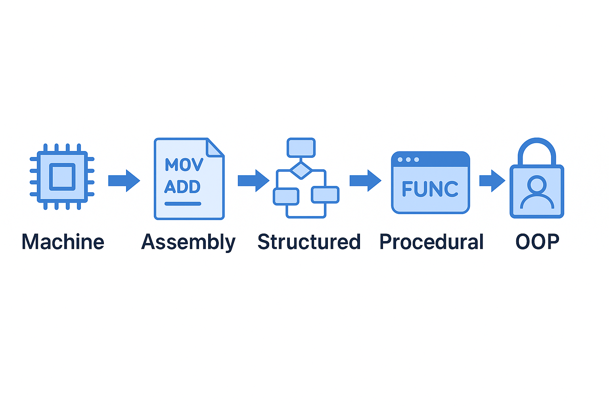
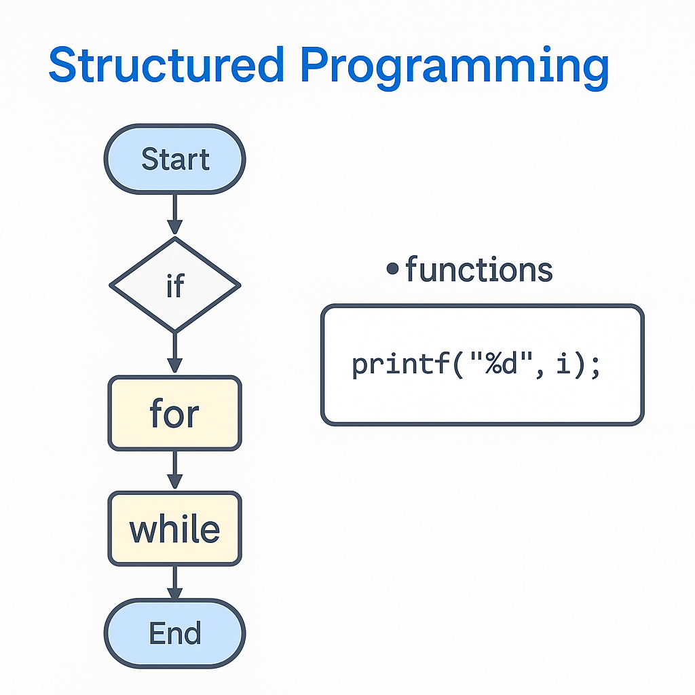
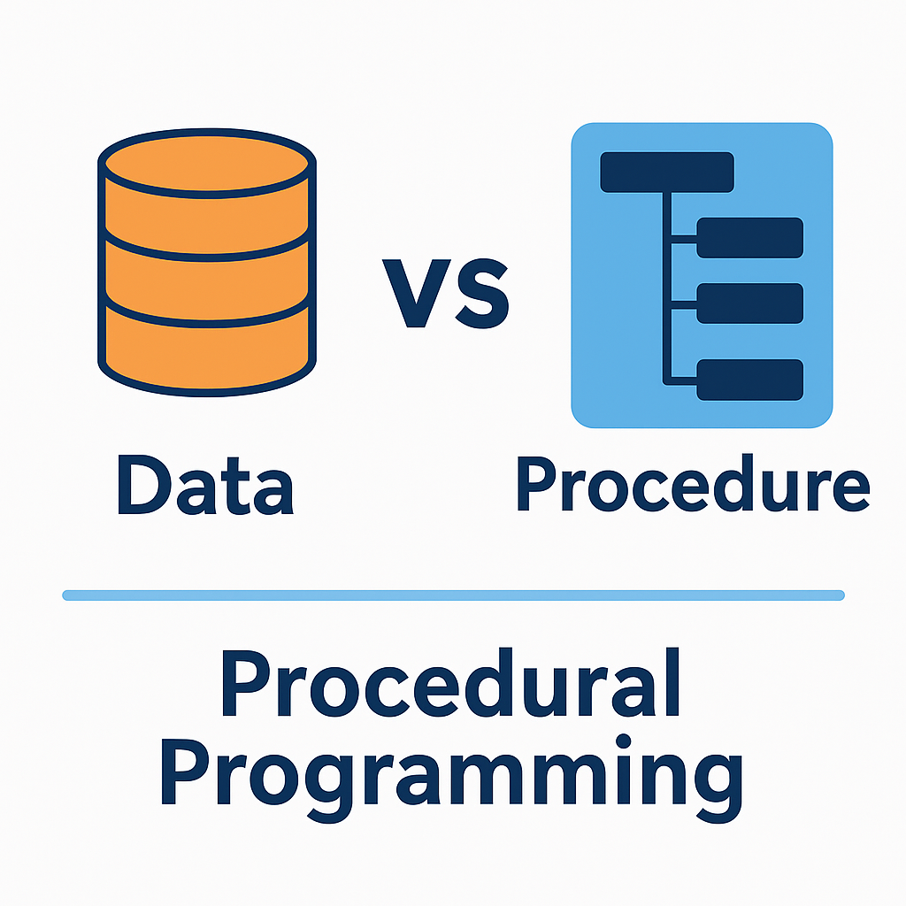
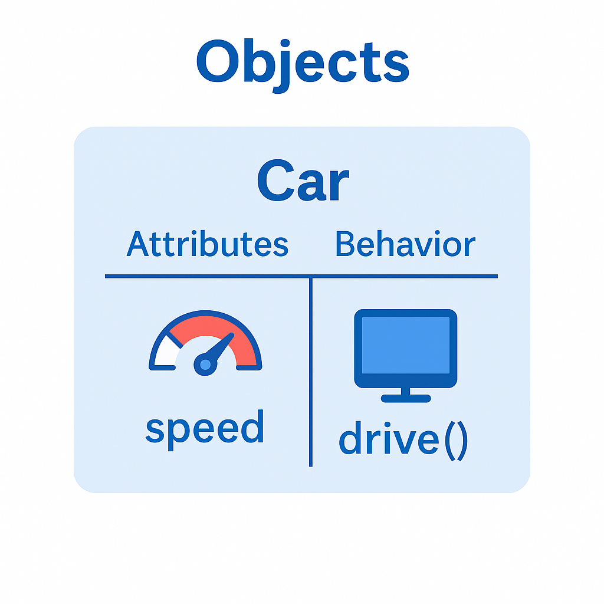
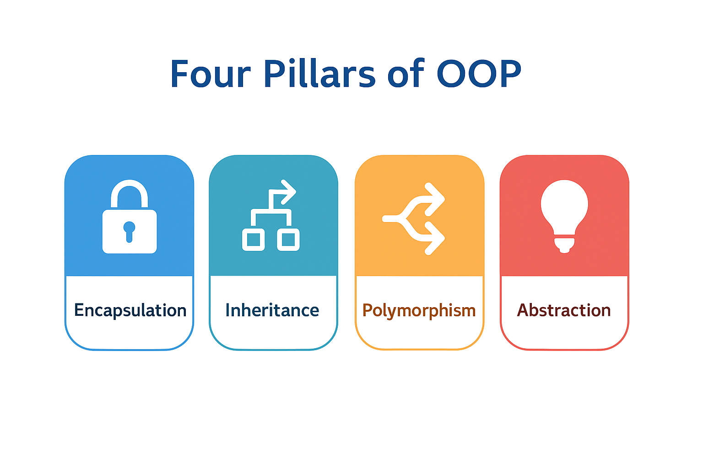
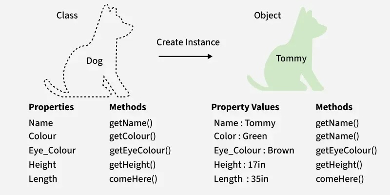
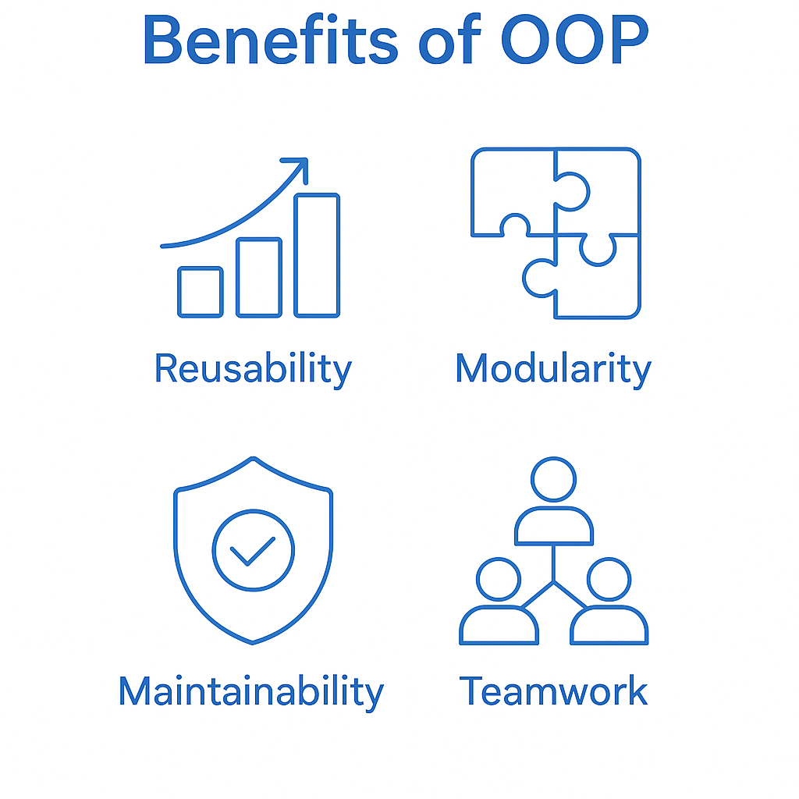
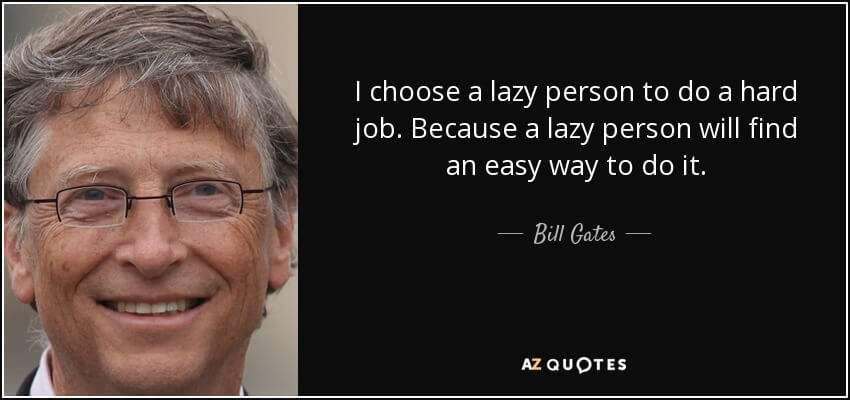

---  
marp: true  
theme: default  
paginate: true  
backgroundColor: #ffffff  
color: #000000  
header: " **Advanced Programming (AP) — OOP Introduction**"  
footer: "**Sharif University of Technology** • Fall 2025 • Mr. Ali Najimi • Hossein Masihi"  
style: |
  :root { --brand: #1966ab; --text: #000000; }
  section { background-color: #ffffff; color: var(--text); font-size: 28px; font-family: "Inter","Segoe UI","Roboto","Helvetica Neue",Arial,sans-serif; }
  h1, h2, h3 { color: var(--brand); font-family: "Inter","Segoe UI","Roboto","Helvetica Neue",Arial,sans-serif; }
  ul { margin-top: 10px; }
  .cols { display: grid; grid-template-columns: 1.2fr 0.8fr; gap: 28px; align-items: start; }
  .imgbox { border: 1px solid #eee; padding: 8px; border-radius: 10px; text-align:center; }
  .imgbox img { border-radius: 10px; border: 3px solid #1966ab; }
  .pill { display:inline-block; padding: 4px 10px; border:1px solid var(--brand); border-radius:999px; color: var(--brand); font-size:20px; }
  section.lead header, section.lead footer { display: none !important; }
---

<!-- _class: lead -->

# Advanced Programming
## Object-Oriented Programming Introduction

**Instructor:** Ali Najimi  
**Author:** Hossein Masihi  
**Department of Computer Engineering**  
**Sharif University of Technology**  
**Fall 2025**

---

# Table of Contents

1. History of Programming Paradigms  
2. Structured Programming  
3. Procedural Programming  
4. Object-Oriented Programming (OOP)  
5. Classes & Objects
6. Four Pillars of OOP  
7. Advantages of OOP  
8. Practice

---

## History of Programming Paradigms

<div class="cols">
<div>

* Machine → Assembly → Structured → Procedural → OOP  
* Each paradigm solved the growing complexity of software.  
* OOP combines **data and behavior** into one logical unit.

</div>
<div>
  <div class="imgbox">



  </div>
</div>
</div>

---

## Structured Programming

<div class="cols">
<div>

* Introduced **loops**, **functions**, and **modules**.  
* Removed “spaghetti code”.  
* Example:

  ```c
  for(int i = 0; i < 5; i++) {
      printf("%d", i);
  }
  ````

</div>
<div>
  <div class="imgbox">



  </div>
</div>
</div>


---

## Procedural Programming

<div class="cols">
<div>

* Uses **functions (procedures)** to organize logic.
* Data and logic are separate.
* Example:

  ```c
  void deposit(float amount) {
      balance += amount;
  }
  ```

</div>
<div>
  <div class="imgbox">



  </div>
</div>
</div>


---

## Object-Oriented Programming (OOP)

<div class="cols">
<div>

* Introduced in **Simula (1967)**, popularized by **C++** and **Java**.
* Models real-world entities as **objects**.
* Example:

  ```java
  class Car {
      int speed;
      void drive() {
          System.out.println("Driving...");
      }
  }
  ```

</div>
<div>
  <div class="imgbox">



  </div>
</div>
</div>


---

## Classes and Objects

<div class="cols">
<div>

* **Class:** blueprint (e.g., Car, Student).
* **Object:** instance of a class.
* **Properties:** Attributes
* **Procedures:** Methods

  ```java
  class Circle {
      double radius;
      double area() {
          return Math.PI * radius * radius;
      }
  }
  Circle c = new Circle();
  c.radius = 5;
  System.out.println(c.area());
  ```

</div>
<div>
  <div class="imgbox">


  </div>
</div>
</div>


---

## Four Pillars of OOP

<div class="cols">
<div>

1. **Encapsulation** – Hide internal data
2. **Inheritance** – Reuse behavior
3. **Polymorphism** – Many forms of one interface
4. **Abstraction** – Show essentials, hide details

</div>
<div>
  <div class="imgbox">



  </div>
</div>
</div>


---

## Classes and Objects: Example

<div class="cols">
<div>

* Define Animal
* Define Dog
* Define Cat
* Define Table
* Define Chair

</div>
<div>
  <div class="imgbox">



  </div>
</div>
</div>

---

## Advantages of OOP

<div class="cols">
<div>

* Improves reusability
* Supports modular design
* Easier debugging
* Enables teamwork
* Better mapping to real-world problems

</div>
<div>
  <div class="imgbox">



  </div>
</div>
</div>


---

# Thank You

<p class="pill">AP — OOP Introduction</p>



*Advanced Programming – Fall 2025 – Sharif University of Technology*

