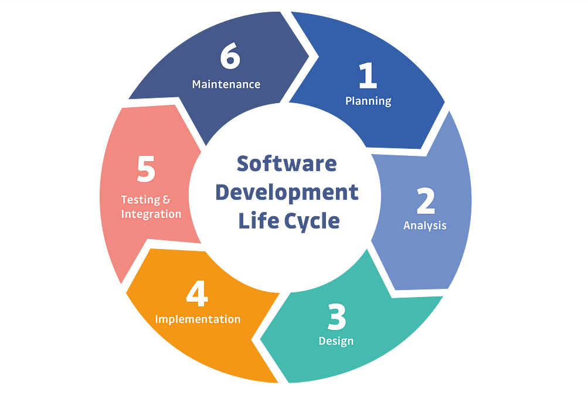
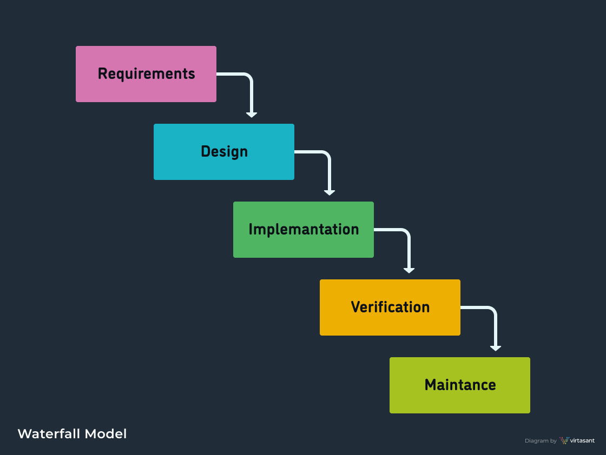
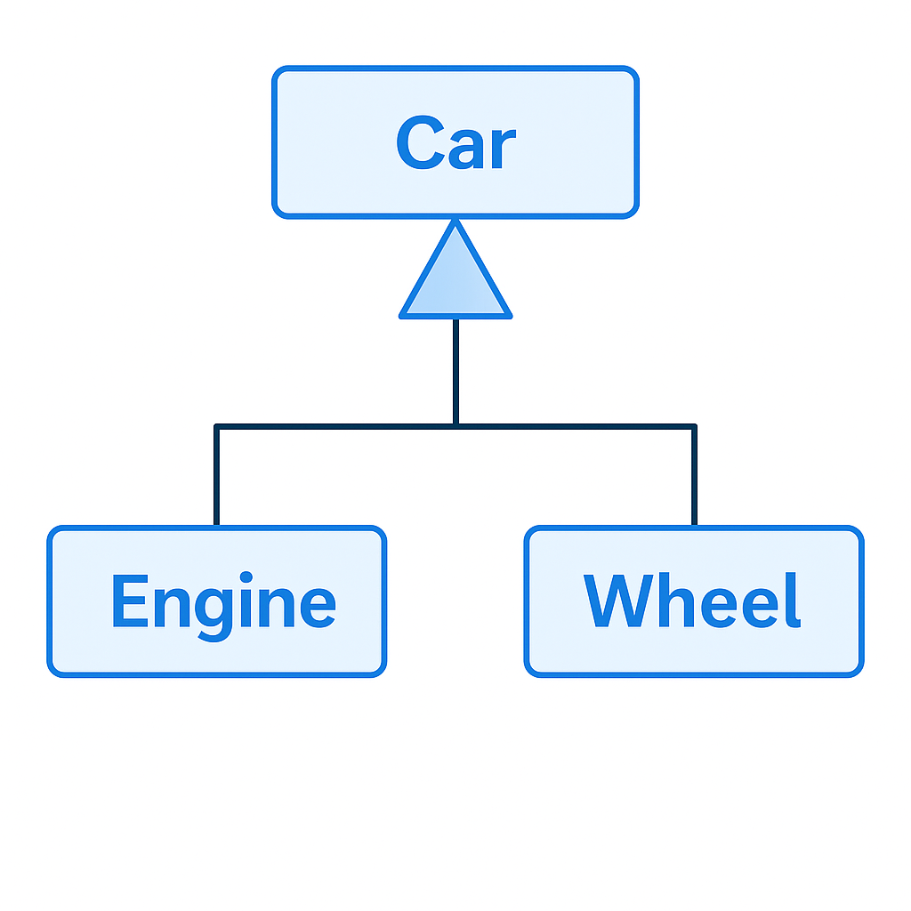
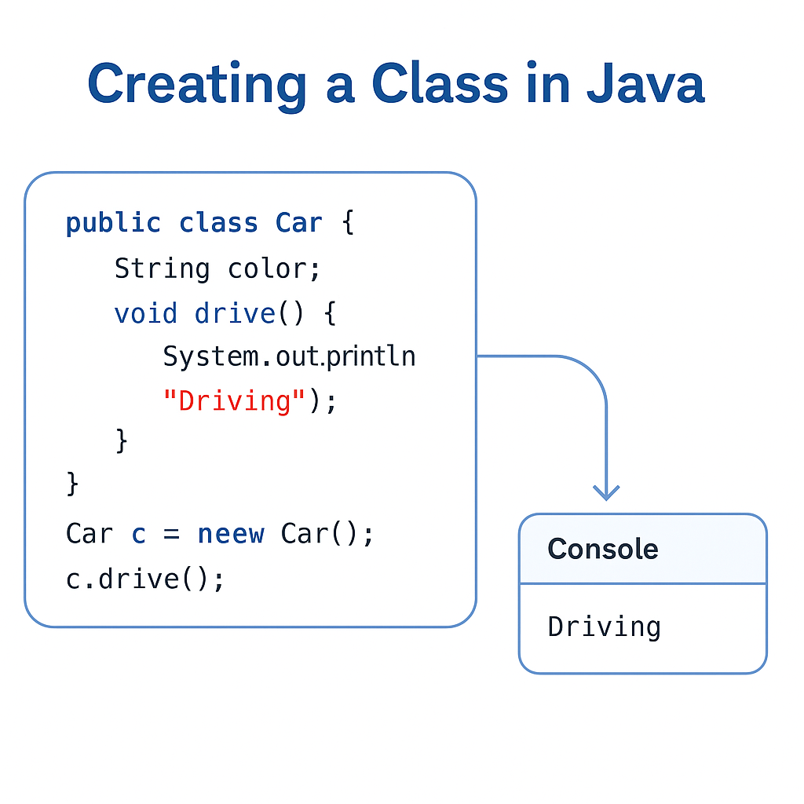
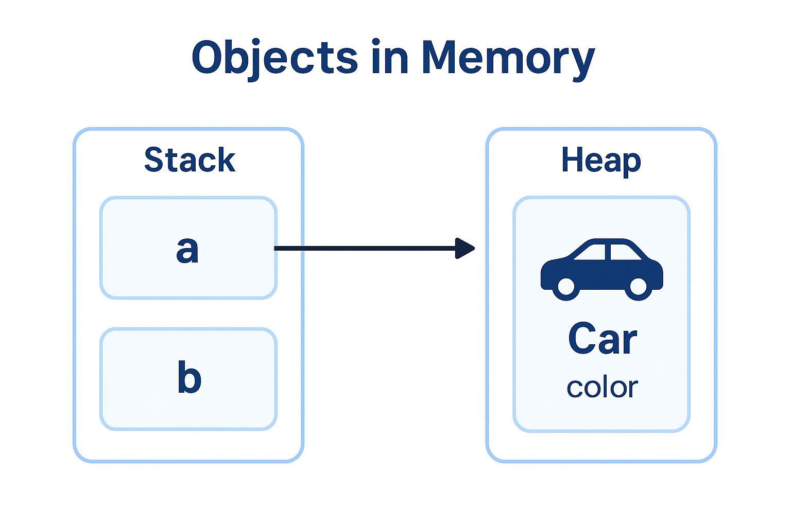
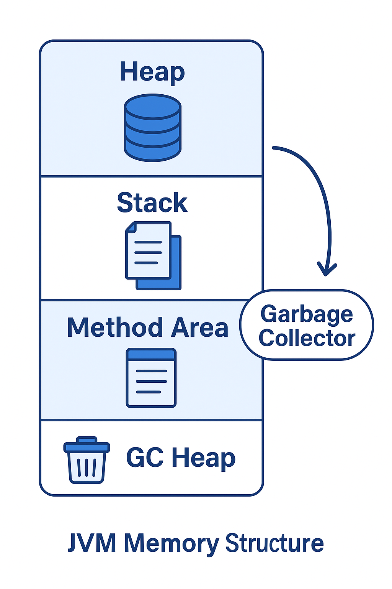
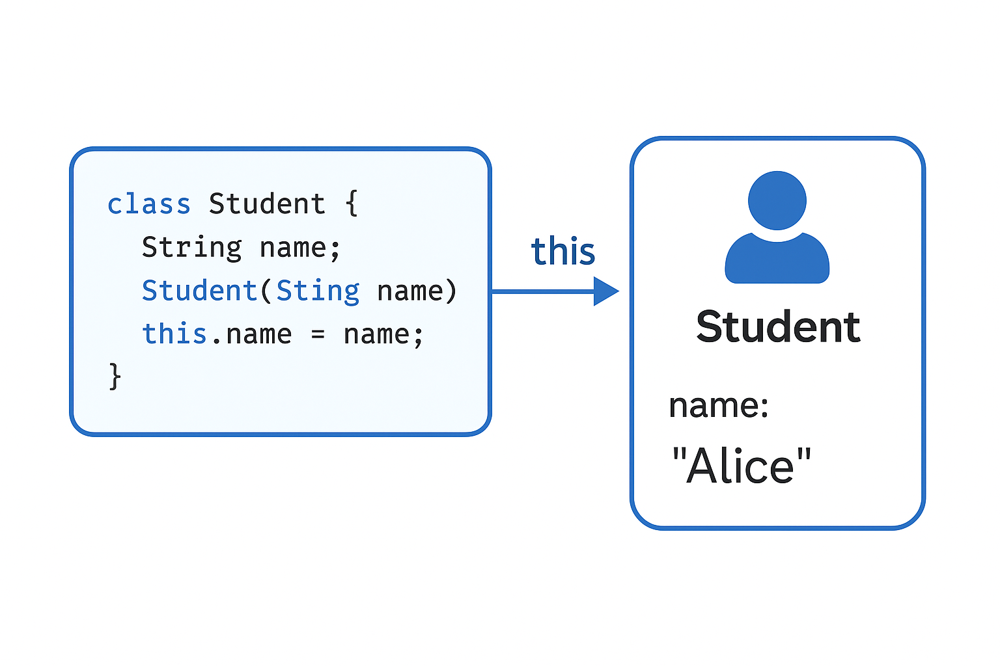
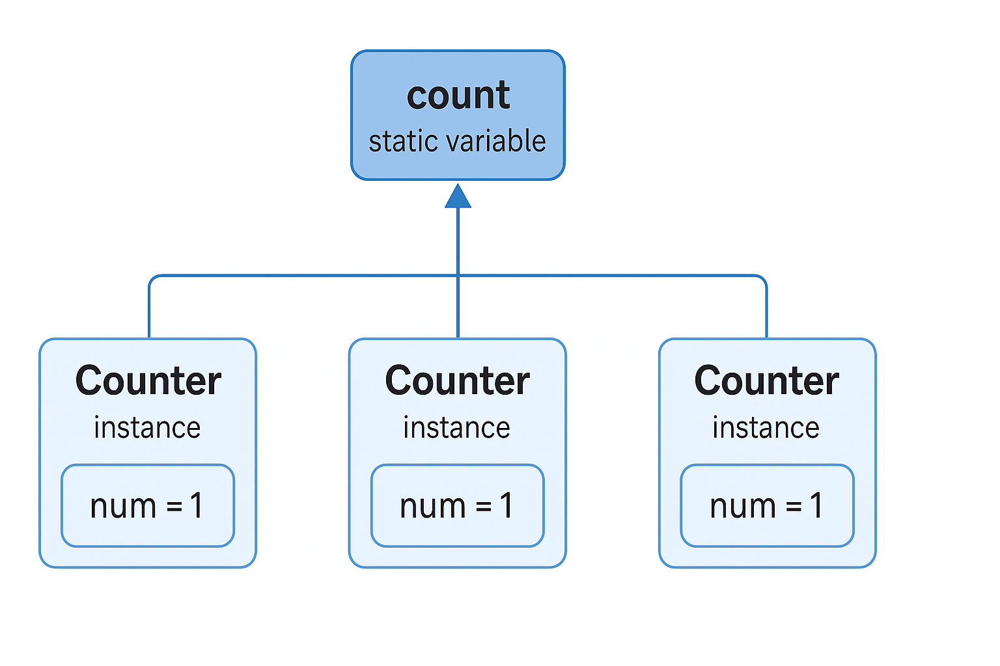
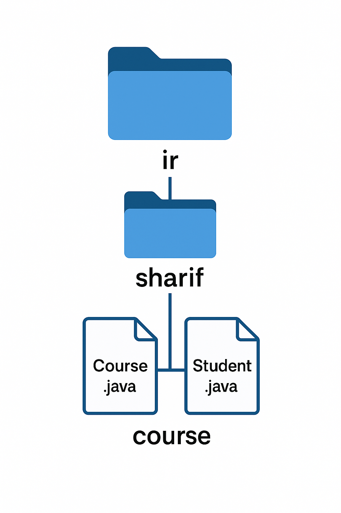
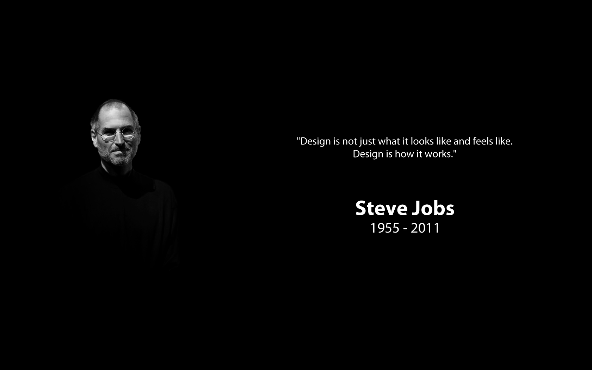

---  
marp: true  
theme: default  
paginate: true  
backgroundColor: #ffffff  
color: #000000  
header: " **Advanced Programming (AP) — OOP in Java**"  
footer: "**Sharif University of Technology** • Fall 2025 • Mr. Ali Najimi • Hossein Masihi"  
style: |
:root { --brand: #1966ab; --text: #000000; }
section { background-color: #ffffff; color: var(--text); font-size: 28px; font-family: "Inter","Segoe UI","Roboto","
Helvetica Neue",Arial,sans-serif; }
h1, h2, h3 { color: var(--brand); font-family: "Inter","Segoe UI","Roboto","Helvetica Neue",Arial,sans-serif; }
ul { margin-top: 10px; }
.cols { display: grid; grid-template-columns: 1.2fr 0.8fr; gap: 28px; align-items: start; }
.imgbox { border: 1px solid #eee; padding: 8px; border-radius: 10px; text-align:center; }
.imgbox img { border-radius: 10px; border: 3px solid #1966ab; }
.pill { display:inline-block; padding: 4px 10px; border:1px solid var(--brand); border-radius:999px; color: var(
--brand); font-size:20px; }
section.lead header, section.lead footer { display: none !important; }
---

<!-- _class: lead -->


# Advanced Programming

## Object-Oriented Programming in Java

**Instructor:** Ali Najimi  
**Author:** Hossein Masihi  
**Department of Computer Engineering**  
**Sharif University of Technology**  
**Fall 2025**

---

# Table of Contents

<div class="cols">
<div>

1. SDLC — Software Development Life Cycle
2. SSDLC — Secure Software Development Life Cycle
3. UML Diagrams
4. Creating Classes
5. Objects in Memory
6. Memory Management
7. Class Loading
8. Garbage Collection
9. Parameter Passing

</div>
<div>

10. Constructor & this
11. `static` Keyword
12. Packaging in Java

</div>
</div>

---

## SDLC — Software Development Life Cycle

<div class="cols">
<div>

* **SDLC** defines structured steps for building software.
* Common phases:
    1. **Requirement Analysis**
    2. **Design**
    3. **Implementation (Coding)**
    4. **Testing**
    5. **Deployment**
    6. **Maintenance**

</div>
<div>
  <div class="imgbox">


  </div>
</div>
</div>

---

<div class="cols">
<div>

* Ensures:
    * Predictable delivery
    * Quality assurance
    * Cost & time control

</div>
<div>
  <div class="imgbox">


  </div>
</div>
</div>

---

## SSDLC — Secure Software Development Life Cycle

<div class="cols">
<div>

* **SSDLC** = SDLC + integrated **security at every stage**.
* Adds security practices such as:
    * Threat modeling
    * Secure coding guidelines
    * Security testing & auditing
    * Vulnerability management

</div>
<div>
  <div class="imgbox">


  </div>
</div>
</div>

---

<div class="cols">
<div>

* Goal: build software that is **secure by design**.
* Common frameworks:
    * Microsoft SDL
    * OWASP SAMM
    * NIST SSDF

</div>
<div>
  <div class="imgbox">


  </div>
</div>
</div>

---

## UML Diagrams

<div class="cols">
<div>

* Visualize system structure.
* Relationships:
    * Association (→)
    * Inheritance (▷)
    * Composition / Aggregation (◇)

</div>
<div>
  <div class="imgbox">



  </div>
</div>
</div>

---

## Creating a Class in Java

<div class="cols">
<div>

  ```java
  public class Car {
    String color;

    void drive() {
        System.out.println("Driving");
    }
}

Car c = new Car();
  c.

drive();
````

</div>
<div>
  <div class="imgbox">



  </div>
</div>
</div>

---

## Objects in Memory

<div class="cols">
<div>

* Objects live in **Heap**, references on **Stack**.
* Example:

  ```java
  Car a = new Car();
  Car b = a;
  ```

  → both point to the same object.

</div>
<div>
  <div class="imgbox">



  </div>
</div>
</div>

---

## Java Memory Management

<div class="cols">
<div>

* Heap → objects
* Stack → local vars
* GC → automatic cleanup
* JVM manages lifecycle

</div>
<div>
  <div class="imgbox">



  </div>
</div>
</div>

---

## Constructors and this Keyword

<div class="cols">
<div>

```java
class Student {
    String name;

    Student(String name) {
        this.name = name;
    }
}
```

* Called automatically at object creation.
* `this` → current object reference.

</div>
<div>
  <div class="imgbox">



  </div>
</div>
</div>

---

## static Keyword

<div class="cols">
<div>

* Belongs to the **class**, not objects.
* Shared between all instances.

  ```java
  class Counter {
      static int count = 0;
      Counter() { count++; }
  }
  ```

</div>
<div>
  <div class="imgbox">



  </div>
</div>
</div>

---

## Packaging in Java

<div class="cols">
<div>

```java
package ir.sharif.course;

import java.util.*;
```

* Groups related classes.
* Prevents naming conflicts.

</div>
<div>
  <div class="imgbox">



  </div>
</div>
</div>

---

<!-- _class: lead -->

<div class="cols">
<div>

# Thank You

<p class="pill">AP — OOP in Java</p>
</div>
</div>
<div>
  <div class="imgbox">



  </div>
</div>

*Advanced Programming – Fall 2025 – Sharif University of Technology*
