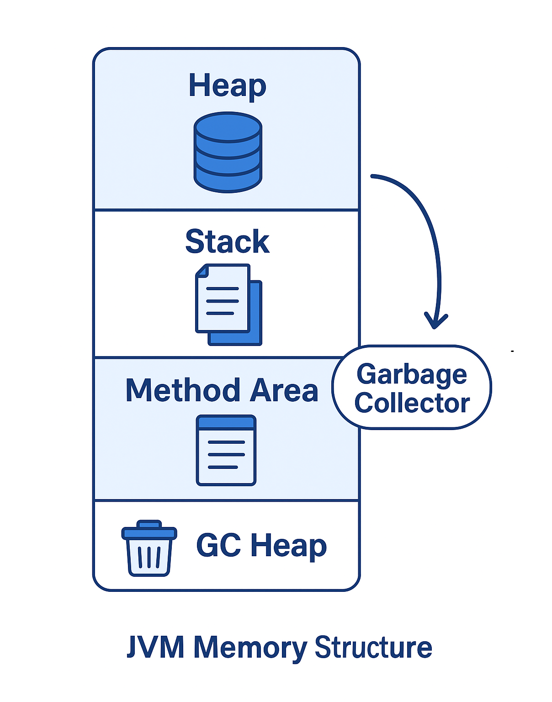

---  
marp: true  
theme: default  
paginate: true  
backgroundColor: #ffffff  
color: #000000  
header: " **Advanced Programming (AP) — OOP in Java**"  
footer: "**Sharif University of Technology** • Fall 2025 • Mr. Ali Najimi • Hossein Masihi"  
style: |
  :root { --brand: #1966ab; --text: #000000; }
  section { background-color: #ffffff; color: var(--text); font-size: 28px; font-family: "Inter","Segoe UI","Roboto","Helvetica Neue",Arial,sans-serif; }
  h1, h2, h3 { color: var(--brand); font-family: "Inter","Segoe UI","Roboto","Helvetica Neue",Arial,sans-serif; }
  ul { margin-top: 10px; }
  .cols { display: grid; grid-template-columns: 1.2fr 0.8fr; gap: 28px; align-items: start; }
  .imgbox { border: 1px solid #eee; padding: 8px; border-radius: 10px; text-align:center; }
  .imgbox img { border-radius: 10px; border: 3px solid #1966ab; }
  .pill { display:inline-block; padding: 4px 10px; border:1px solid var(--brand); border-radius:999px; color: var(--brand); font-size:20px; }
  section.lead header, section.lead footer { display: none !important; }
---

<!-- _class: lead -->

# Advanced Programming
## Object-Oriented Programming  
### in Java

**Instructor:** Dr. Ali Najimi  
**Author:** Hossein Masihi  
**Department of Computer Engineering**  
**Sharif University of Technology**  
**Fall 2025**

---

# Table of Contents

1. UML Diagrams  
2. Creating Classes  
3. Objects in Memory  
4. Memory Management  
5. Class Loading  
6. Garbage Collection  
7. Parameter Passing  
8. Constructor & this  
9. `static` Keyword  
10. Packaging in Java

---

## UML Diagrams

<div class="cols">
<div>

* Visualize system structure.  
* Relationships:
  * Association (→)
  * Inheritance (▷)
  * Composition / Aggregation (◇)

</div>
<div>
  <div class="imgbox">


  </div>
</div>
</div>


---

## Creating a Class in Java

<div class="cols">
<div>

  ```java
  public class Car {
      String color;
      void drive() {
          System.out.println("Driving");
      }
  }
  Car c = new Car();
  c.drive();
  ``` 

</div>
<div>
  <div class="imgbox">


  </div>
</div>
</div>


---

## Objects in Memory

<div class="cols">
<div>

* Objects live in **Heap**, references on **Stack**.
* Example:

  ```java
  Car a = new Car();
  Car b = a;
  ```

  → both point to the same object.
</div>
<div>
  <div class="imgbox">


  </div>
</div>
</div>


---

## Java Memory Management

<div class="cols">
<div>

* Heap → objects
* Stack → local vars
* GC → automatic cleanup
* JVM manages lifecycle

</div>
<div>
  <div class="imgbox">



  </div>
</div>
</div>


---

## Constructors and this Keyword

<div class="cols">
<div>

  ```java
  class Student {
      String name;
      Student(String name) {
          this.name = name;
      }
  }
  ```

* Called automatically at object creation.
* `this` → current object reference.

</div>
<div>
  <div class="imgbox">


  </div>
</div>
</div>


---

## static Keyword

<div class="cols">
<div>

* Belongs to the **class**, not objects.
* Shared between all instances.

  ```java
  class Counter {
      static int count = 0;
      Counter() { count++; }
  }
  ```

</div>
<div>
  <div class="imgbox">


  </div>
</div>
</div>

---

## Packaging in Java

<div class="cols">
<div>

  ```java
  package ir.sharif.course;
  import java.util.*;
  ```

* Groups related classes.
* Prevents naming conflicts.

</div>
<div>
  <div class="imgbox">


  </div>
</div>
</div>


---

# Thank You 

> “Programs must be written for people to read,  
> and only incidentally for machines to execute.” — *Hal Abelson*

<p class="pill">AP — OOP in Java</p>

*Advanced Programming – Fall 2025 – Sharif University of Technology*
