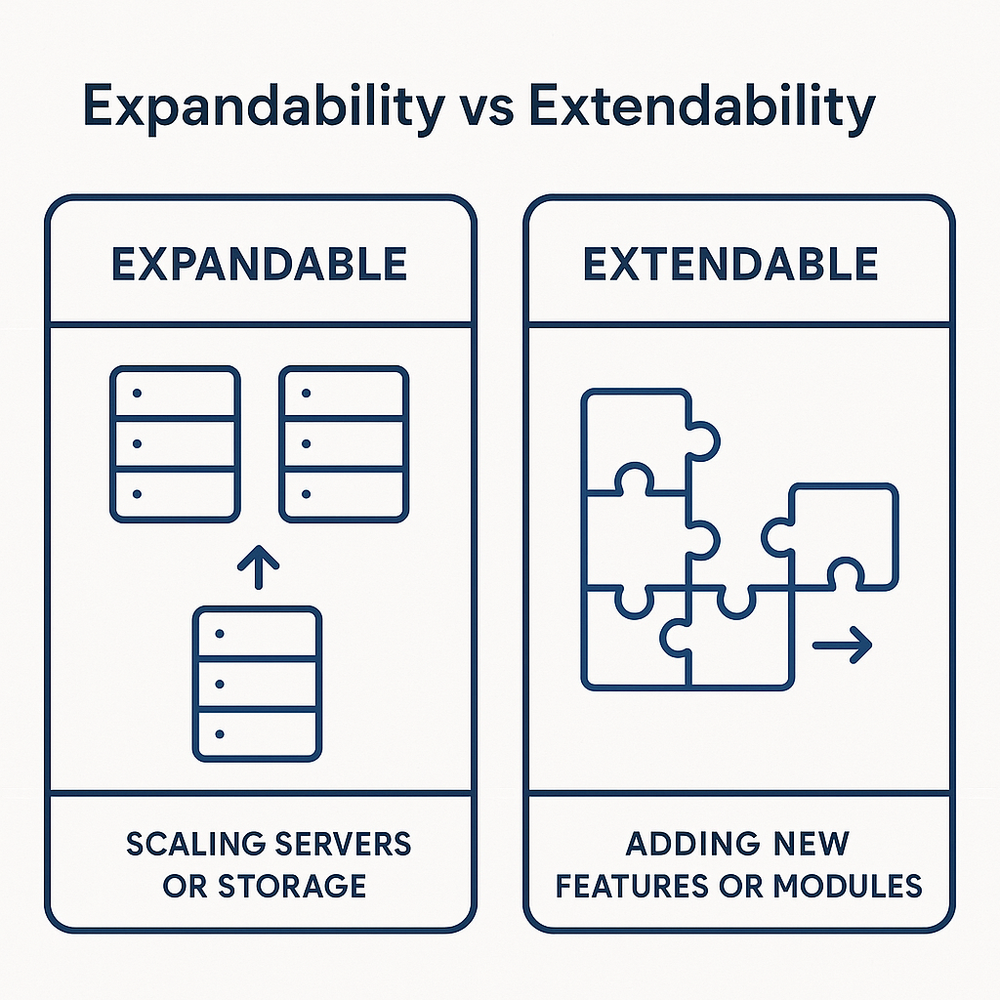
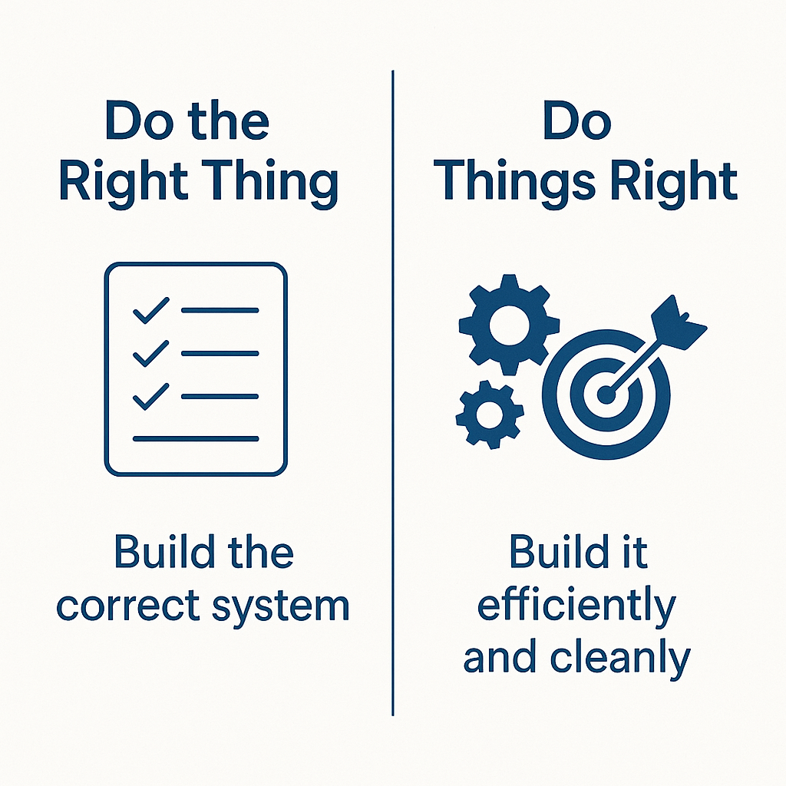
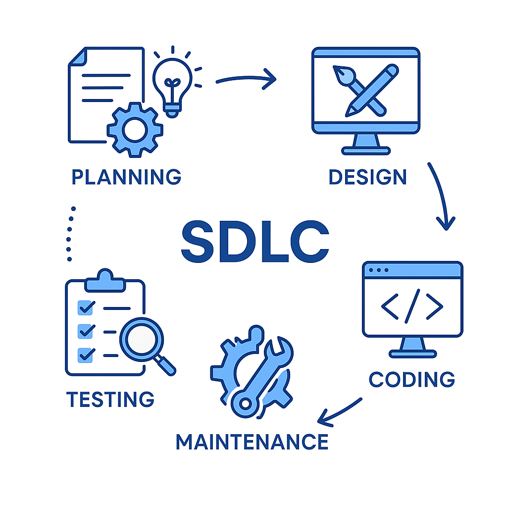
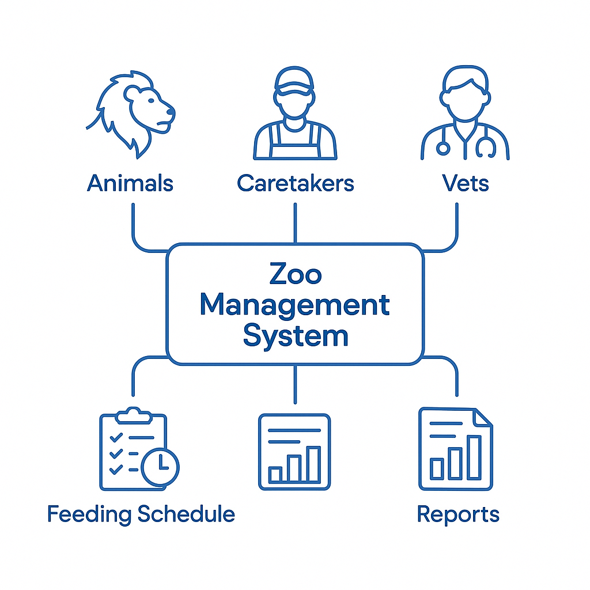
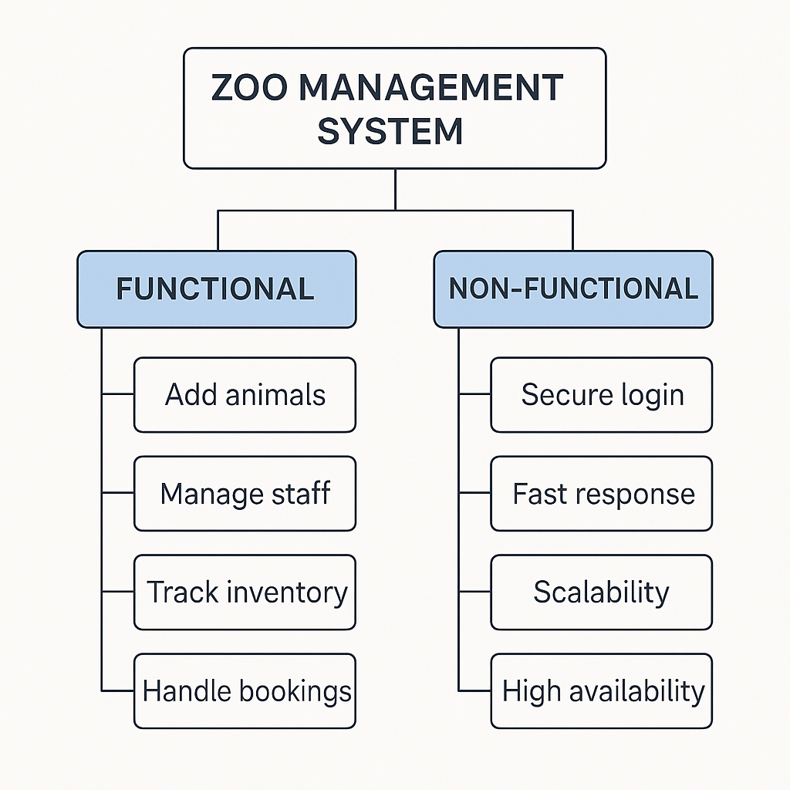
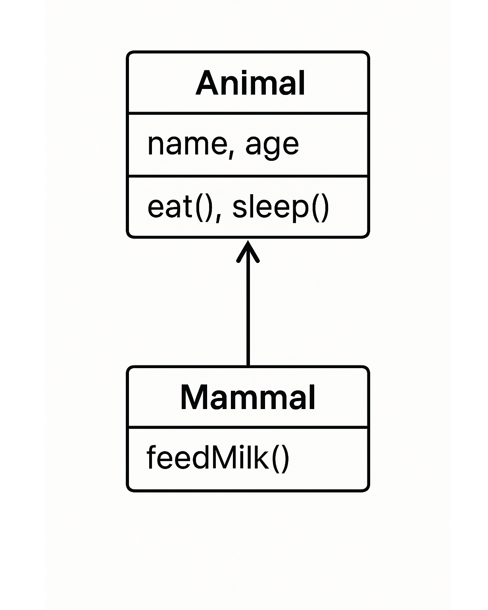
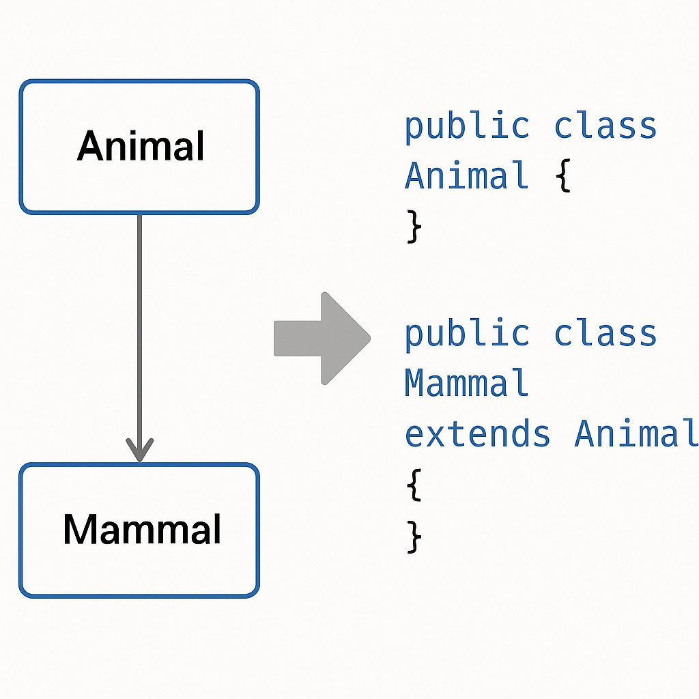
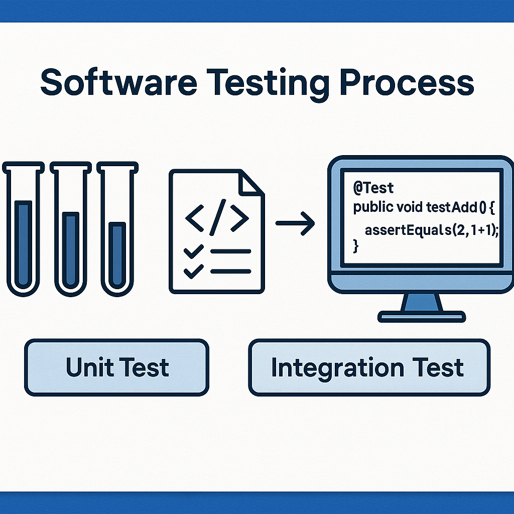
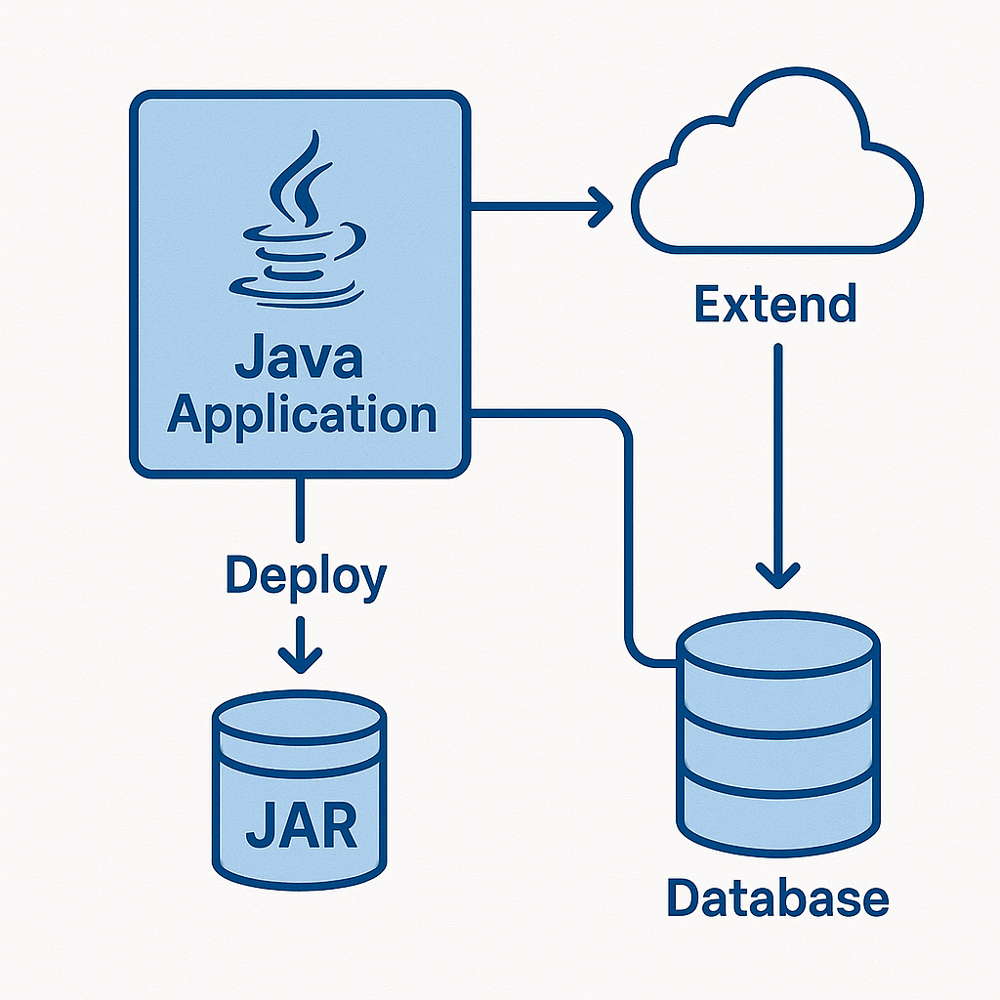

<!-- _class: lead -->

# Advanced Programming
## From Software Engineering to OOP in Java

**Instructor:** Ali Najimi  
**Author:** Hossein Masihi  
**Department of Computer Engineering**  
**Sharif University of Technology**  
**Fall 2025**

---

# Table of Contents

1. Expandable vs Extendable  
2. Do the Right Thing vs Do Things Right  
3. What is Software Engineering  
4. Applying SDLC to a Real Case  
5. Case Study: Zoo Management System  
6. From UML to Java Implementation  
7. Testing and Maintenance

---

## Expandable vs Extendable

<div class="cols">
<div>

* **Expandable:**  
  Ability to grow in **capacity or scale**  
  → Example: adding more memory, database nodes, or cages to the zoo.

* **Extendable:**  
  Ability to grow in **functionality**  
  → Example: adding new animal categories or new modules without rewriting old code.

> Good software is both expandable and extendable.

</div>
<div>
<div class="imgbox">


</div>
</div>
</div>

---

## Do the Right Thing vs Do Things Right

<div class="cols">
<div>

| Principle | Focus                             |
|------------|-----------------------------------|
| **Do the Right Thing** | Build a system effectively        |
| **Do Things Right** | Build it efficiently, and cleanly |

> Example:  
> `Do the Right Thing:` Create a Zoo system: manages animals  
> `Doing it Right:` Using OOP design, have testing, documentation.

</div>
<div>
  <div class="imgbox">


  </div>
</div>
</div>

---

# Software Engineering

<div class="cols">
<div>

* Systematic approach to software design and construction.  
* Key elements:
  - Process models (like **SDLC**)  
  - Documentation and design  
  - Quality control and testing  
  - Maintenance and scalability

> The goal: to make software **reliable**, **maintainable**, and **evolvable**.

</div>
<div>
  <div class="imgbox">


  </div>
</div>
</div>

---

# Applying SDLC: Overview

* SDLC defines **how** software evolves from idea to deployment.  
* We’ll now apply it step-by-step to a real system:  
  **The Zoo Management System.**

| Phase | Description |
|--------|-------------|
| 1 | Requirement Analysis |
| 2 | Design (UML, Architecture) |
| 3 | Implementation (Java / OOP) |
| 4 | Testing |
| 5 | Deployment & Maintenance |

---

# Case Study — Zoo Management System

<div class="cols">
<div>

### Problem Definition
A zoo needs a system to:
* Track animals, health, and feeding schedules  
* Manage caretakers and vets  
* Generate daily and monthly reports  

### Goal
To design and implement a **modular**, **extendable**, and **object-oriented** solution.

</div>
<div>
  <div class="imgbox">


  </div>
</div>
</div>

---

# 1. Requirement Analysis

<div class="cols">
<div>

### Functional Requirements
* Create - Read - Update - Delete
* For Animals, Storage, etc.
* Record feedings and treatments  
* Manage staff and shifts  
* Generate reports and alerts  

### Non-Functional Requirements
* Secure login for staff  
* Fast response time (<1s)  
* Future-proof, extendable design  

</div>
<div>
  <div class="imgbox">


  </div>
</div>
</div>

---

# 2. System Design — UML & Architecture

<div class="cols">
<div>

### Architecture Layers
* **UI Layer:** Staff Dashboard  
* **Logic Layer:** ZooManager (Java)  
* **Data Layer:** MySQL / PostgreSQL  

### UML Class Diagram
Represents the main system entities.

```plaintext
+-------------+
| Animal      |
|-------------|
| name, age   |
|-------------|
| eat(), sleep() |
+-------------+
       ▲
       │
+-------------+
| Mammal      |
|-------------|
| feedMilk()  |
+-------------+
````

</div>
<div>
  <div class="imgbox">


  </div>
</div>
</div>

---

# 3. Implementation — From UML to Java

<div class="cols">
<div>

```java
public class Animal {
    private String name;
    private int age;

    public Animal(String name, int age) {
        this.name = name;
        this.age = age;
    }

    public void eat() {
        System.out.println(name + " is eating...");
    }
}
```

```java
public class Mammal extends Animal {
    public Mammal(String name, int age) {
        super(name, age);
    }

    public void feedMilk() {
        System.out.println(getName() + " is feeding milk.");
    }
}
```

</div>
<div>
  <div class="imgbox">


  </div>
</div>
</div>

---

# 4. Testing Phase

<div class="cols">
<div>

### Unit Testing Example

```java
@Test
public void testEat() {
    Animal lion = new Animal("Lion", 5);
    lion.eat(); // Expected: "Lion is eating..."
}
```

### Integration Tests

* Add animal → Assign caretaker → Generate report
* Check data persistence and relations

> Testing validates both correctness and integration.

</div>
<div>
  <div class="imgbox">


  </div>
</div>
</div>

---

# 5. Deployment and Maintenance

<div class="cols">
<div>

* Package the Java application into a `.jar`
* Deploy on a local server or cloud instance
* Connect to a MySQL/PostgreSQL database
* Future maintenance:

  * Add new animal subclasses
  * Extend report generation
  * Improve UI responsiveness

> The system remains extendable without rewriting core logic.

</div>
<div>
  <div class="imgbox">


  </div>
</div>
</div>

---

# Final Discussion

| Concept                | In Practice                                     |
| ---------------------- | ----------------------------------------------- |
| **Expandable**         | More animals, cages, or DB capacity             |
| **Extendable**         | New modules like visitor management             |
| **Do the Right Thing** | Address the zoo’s real operational needs        |
| **Do Things Right**    | Use OOP, SDLC, and clean Java design            |
| **SDLC Applied**       | Zoo System built step by step, tested, deployed |

> Software engineering and OOP are two sides of the same goal:
> building reliable, scalable, and maintainable systems.

---

<!-- _class: lead -->

# Thank You

<div class="cols">
<div> 
<p class="pill">From Software Engineering to OOP in Java</p>
</div>
<div>
  <div class="imgbox">


  </div>
</div>
</div>

*Advanced Programming – Fall 2025 – Sharif University of Technology*
