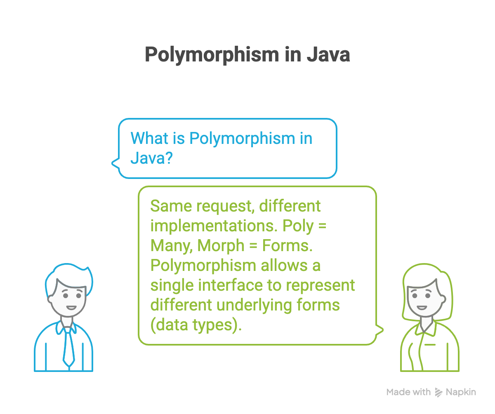
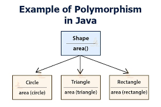
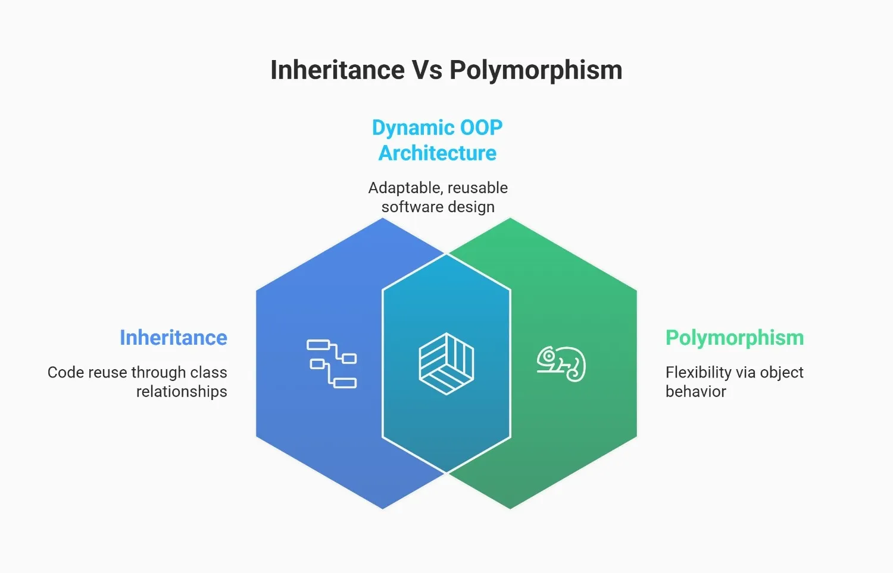
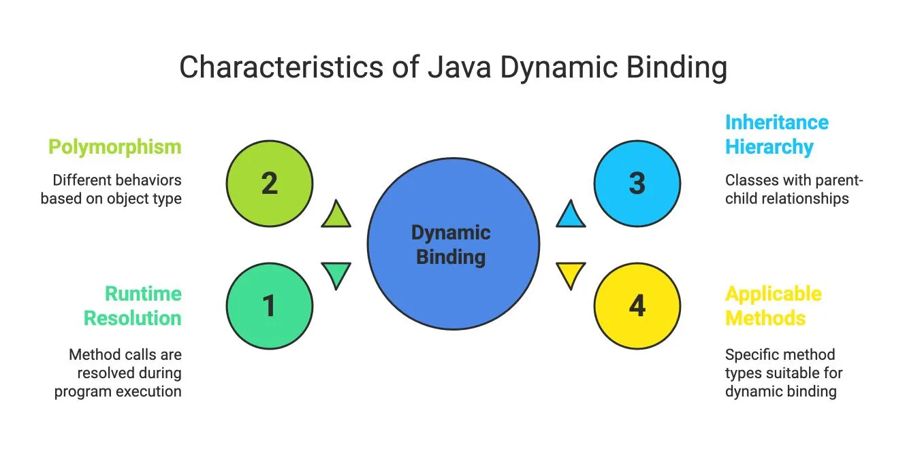
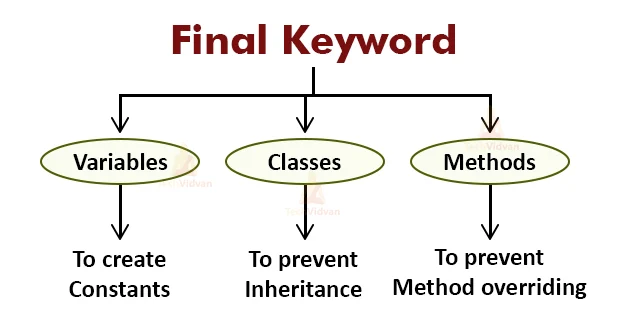
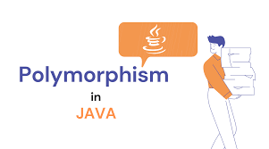

<!-- _class: lead -->

# Advanced Programming
## Polymorphism in Java — Extended Edition

**Instructor:** Ali Najimi  
**Author:** Hossein Masihi  
**Department of Computer Engineering**  
**Sharif University of Technology**  
**Fall 2025**

---

# Table of Contents

1. Polymorphism — Concept
2. Compile-time (Overloading)
3. Runtime (Overriding)
4. How It Works with Inheritance
5. The `final` Keyword
6. Dynamic Binding Explained
7. Summary

---

<div class="imgbox">
  
  
  </div>

---

# Polymorphism — Concept

<div class="cols">
<div>

* **Polymorphism** = “many forms”
* Same method name, **different behavior**
* Enables flexibility and **code reuse**

Two types:
1. **Compile-time (Static)** → *Overloading*
2. **Runtime (Dynamic)** → *Overriding*

> JVM decides which method to call at runtime for overriding.

</div>
<div>
  <div class="imgbox">

  
  
  </div>
</div>
</div>

---

# Compile-time Polymorphism — Method **Overloading**

```java
class Printer {
    void print(int value) {System.out.println("Integer: " + value);}
    void print(String value) {System.out.println("String: " + value);}
    void print(double value, int count) {
        System.out.println("Double: " + value + ", count: " + count);
    }
}
```
```java
Printer p = new Printer();
p.print(42);
p.print("Sharif");
p.print(3.14, 2);
```

>  Same method name, different **parameter list**.  
>  Return type alone cannot differentiate methods.

---

# Notes — Overloading Rules
| Rule                  | Description                                        |
|-----------------------|----------------------------------------------------|
| **Name & Parameters** | Must be identical to parent’s method               |
| **Return Type**       | Same or covariant (subtype allowed)                |
| **Access Modifier**   | Can be wider, not more restrictive                 |
| **Exceptions**        | Only same or subclass checked exceptions           |
| **Occurs**            | Happens at **compile** (compile-time polymorphism) |
| **@Overload**         | Optional but strongly recommended                  |


> The compiler picks the best match for the arguments.

---

# Runtime Polymorphism — Method **Overriding**

```java
class Animal {
    void sound() { System.out.println("Animal sound"); }
}

class Dog extends Animal {
    @Override
    void sound() { System.out.println("Woof"); }
}

class Cat extends Animal {
    @Override
    void sound() { System.out.println("Meow"); }
}
```
---

```java
Animal a1 = new Dog();
Animal a2 = new Cat();
a1.sound(); // Woof
a2.sound(); // Meow
```

>  Same method signature, different implementations.  
> Happens **at runtime** through *dynamic method dispatch*.

---

# Rules — Method Overriding

| Rule                  | Description                                   |
| --------------------- | --------------------------------------------- |
| **Name & parameters** | Must match exactly with parent method         |
| **Return type**       | Same or subtype (covariant)                   |
| **Access modifier**   | Can’t be more restrictive than parent         |
| **Static / final**    | These methods can’t be overridden             |
| **Occurs**            | Happens at **runtime** (runtime polymorphism) |


> Use `@Override` annotation to avoid mistakes.

---

# How Polymorphism Works with Inheritance


* Inheritance → **structure and reusability**
* Polymorphism → **behavioral flexibility**

```java
Animal a = new Dog();
a.sound(); // Executes Dog’s method
```

> The reference type determines available members,  
> but the **object type** determines which method runs.


---
<div class="imgbox">
  
  
  </div>
---

# Dynamic Method Dispatch (Runtime Binding)

```java
class Animal {              void makeSound() { System.out.println("Animal sound");} }
class Dog extends Animal {  void makeSound() { System.out.println("Dog barks"); } }
class Cat extends Animal {  void makeSound() { System.out.println("Cat meows"); } }

public class Test {
    public static void main(String[] args) {
        Animal a = new Dog();
        a.makeSound();  // Dog barks
        a = new Cat();
        a.makeSound();  // Cat meows
    }
}
```

> The method call is resolved at **runtime** — not compile time.  
> This is **Dynamic Method Dispatch** in Java.

---

# Visualizing Dynamic Binding

<div class="imgbox">


</div>

> 🔹 Compiler binds by **reference type**  
> 🔹 JVM executes by **object type**

---

# The `final` Keyword — Restrictions

<div class="cols">
<div>

* **final variable** → cannot change value
* **final method** → cannot be overridden
* **final class** → cannot be subclassed

Used for **security, performance**, and **immutability**.

</div>
<div>
  <div class="imgbox">

  
  </div>
</div>
</div>

---

# Examples — `final` Usage

```java
final class Animal {}  // cannot have subclass
class Dog {
    final void bark() {
        System.out.println("Woof!");
    }
}
```

```java
class Zoo {
    final String name = "Sharif Zoo";
    void display() {
        // name = "Tehran Zoo"; // not allowed
        System.out.println(name);
    }
}
```

> `final` = permanent → protects design integrity.

---

# Overloading vs Overriding — Summary

| Feature                  | **Overloading**               | **Overriding**            |
| ------------------------ | ----------------------------- | ------------------------- |
| **Binding time**         | Compile-time                  | Runtime                   |
| **Method name**          | Same                          | Same                      |
| **Parameters**           | Must differ                   | Must match exactly        |
| **Return type**          | Can differ                    | Must be same or covariant |
| **Access level**         | Can change freely             | Can’t reduce visibility   |
| **Inheritance required** | No                          | Yes                     |
| **Purpose**              | Same action, different inputs | Change inherited behavior |

---

# Real-world Example

```java
class Payment {
    void pay() { System.out.println("Generic payment"); }
}
class CreditCard extends Payment {
    @Override
    void pay() { System.out.println("Paying via Credit Card"); }
}
class PayPal extends Payment {
    @Override
    void pay() { System.out.println("Paying via PayPal"); }
}
public class Checkout {
    public static void main(String[] args) {
        Payment p = new CreditCard();
        p.pay();
        p = new PayPal();
        p.pay();
    }
}
```

> Same method → multiple implementations.  
> Common pattern in frameworks (e.g. Spring, Android).

---

# Summary

| Concept             | Description                                                        |
| ------------------- | ------------------------------------------------------------------ |
| **Overloading**     | Compile-time polymorphism — same method name, different parameters |
| **Overriding**      | Runtime polymorphism — child redefines parent method               |
| **Dynamic Binding** | Actual object type decides which method runs at runtime            |
| **final**           | Prevents overriding or inheritance of classes/methods              |
| **Inheritance**     | Foundation for code reuse and polymorphism                         |


> Polymorphism + Inheritance = Core of OOP flexibility.

---

<!-- _class: lead -->
# Thank You!

<div class="cols">
<div>
<p class="pill">Polymorphism in Java — Extended</p>
</div>
<div class="imgbox">


</div>
</div>

*Advanced Programming — Fall 2025 — Sharif University of Technology*
