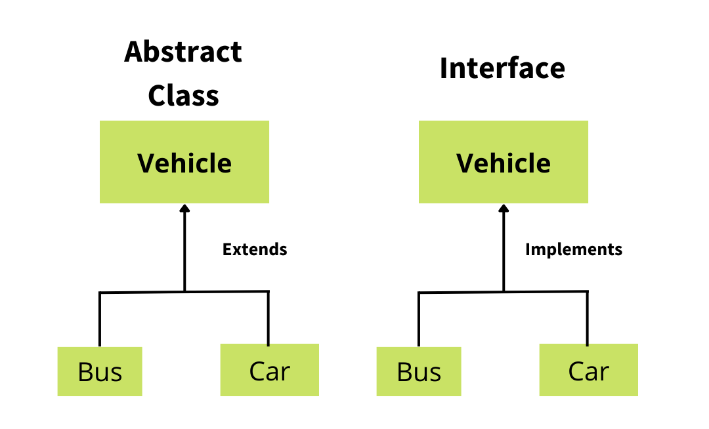
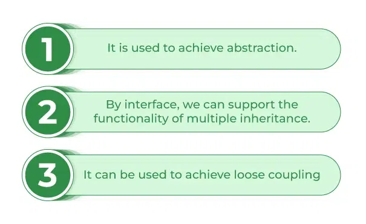
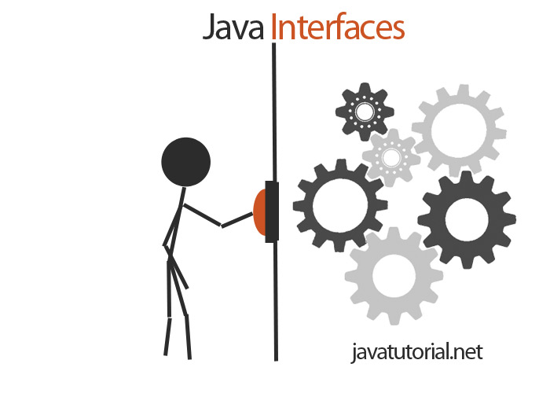

<!-- _class: lead -->

# Advanced Programming
## Interfaces in Java — Extended Edition

**Instructor:** Ali Najimi  
**Author:** Hossein Masihi  
**Department of Computer Engineering**  
**Sharif University of Technology**  
**Fall 2025**

---

# Table of Contents

1. Interface — Concept  
2. Purpose and Benefits  
3. Declaring and Implementing Interfaces  
4. Default and Static Methods  
5. Interface vs Abstract Class  
6. Multiple Interface Implementation  
7. Real-World Example  
8. Summary and Key Takeaways

---

<div class="imgbox">


</div>

---

# Interface — Concept

<div class="cols">
<div>

* An **interface** defines a set of **method signatures**
* Specifies *what* a class must do — not *how*
* Classes **implement** interfaces
* Enables **polymorphism** through behavior contracts

> Interfaces represent **capabilities**, not structures

</div>
<div>
  <div class="imgbox">

  
  </div>
</div>
</div>

---

# Declaring and Implementing an Interface

```java
interface Shape {
    double area();
    double perimeter();
}
````

```java
class Circle implements Shape {
    private double r;

    Circle(double r) { this.r = r; }

    public double area() { return Math.PI * r * r; }
    public double perimeter() { return 2 * Math.PI * r; }
}
```

> A class must implement **all** interface methods

---

# Why Use Interfaces?

| Benefit              | Description                               |
| -------------------- | ----------------------------------------- |
| Abstraction          | Hide implementation details               |
| Loose Coupling       | Reduces dependency between components     |
| Extensibility        | Easy replacement of behavior              |
| Polymorphism         | Enables behavior switching at runtime     |
| Framework Foundation | Core principle behind Spring / Jakarta EE |

---

# Default and Static Methods (Java 8+)

```java
interface Logger {
    void log(String message);
    default void info(String message) {
        log("INFO: " + message);
    }
    static void help() {System.out.println("Logger usage help");}
}
```

```java
class ConsoleLogger implements Logger {
    public void log(String message) { System.out.println(message); }
}
```

> `default` = shared behavior
> `static` = utility function at interface level

---

# Interface vs Abstract Class

| Feature               | Interface            | Abstract Class               |
| --------------------- | -------------------- | ---------------------------- |
| State (Fields)        | Only constants       | Can have instance variables  |
| Method Implementation | Only default allowed | Can contain method bodies    |
| Constructors          | Not allowed          | Allowed                      |
| Multiple Inheritance  | Allowed              | Not allowed                  |
| Best Usage            | Behavior contract    | Base implementation template |

---

# Multiple Interface Implementation

```java
interface Flyable { void fly(); }
interface Swimmable { void swim(); }

class Duck implements Flyable, Swimmable {
    public void fly() { System.out.println("Duck flying"); }
    public void swim() { System.out.println("Duck swimming"); }
}
```

> Enables **multi-capability classes**

---

# Real-World Example — Payment

```java
interface PaymentMethod {
    void pay(double amount);
}
class CreditCard implements PaymentMethod {
    public void pay(double amount) { System.out.println("Paid via Credit Card"); }
}
class PayPal implements PaymentMethod {
    public void pay(double amount) { System.out.println("Paid via PayPal"); }
}
class Checkout {
    static void process(PaymentMethod method) {
        method.pay(200);
    }
}
```

> System depends on interface → implementations are interchangeable

---

# Summary

| Concept             | Description                                 |
| ------------------- | ------------------------------------------- |
| Interface           | Behavioral contract (what to do)            |
| Implementation      | Provided by classes (how to do it)          |
| Default Methods     | Shared optional behavior                    |
| Multiple Interfaces | Enables multiple capabilities               |
| Goal                | Flexibility, extensibility, maintainability |

> Interfaces are critical for clean, scalable OOP design

---

<!-- _class: lead -->

# Thank You!

<div >
<div>
<p class="pill">Interfaces in Java — Extended</p>
</div>
<div class="imgbox">


</div>
</div>

*Advanced Programming — Fall 2025 — Sharif University of Technology*
