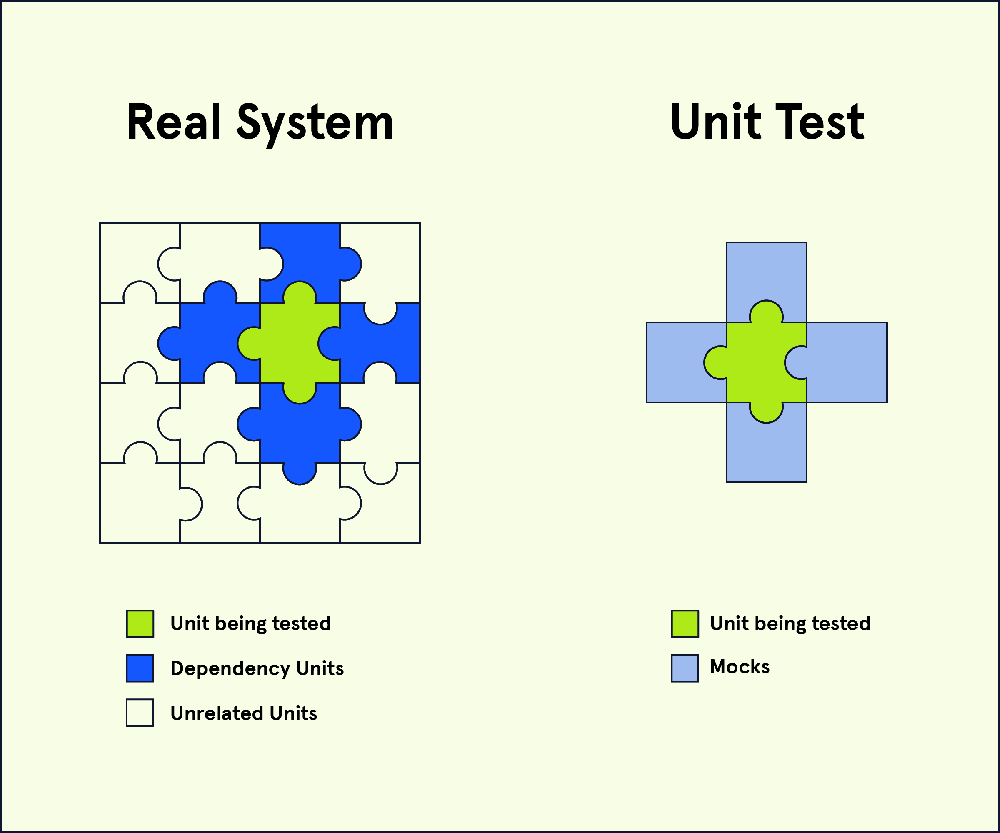
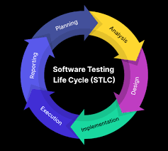

<!-- _class: lead -->

# Advanced Programming
## Software Testing — Foundations, Tools, Practices

**Instructor:** Ali Najimi  
**Author:** Hossein Masihi  
**Department of Computer Engineering**  
**Sharif University of Technology**  
**Fall 2025**

---

# Table of Contents

1. What is Software Testing?  
2. QA vs Testing  
3. Unit Testing  
4. JUnit Framework  
5. Throwing & Handling Exceptions  
6. Mocking Dependencies  
7. Summary

---

# What is Software Testing?

* Software Testing is the process of **verifying and validating** that a software system:
  - Works correctly
  - Meets requirements
  - Handles errors gracefully
  - Maintains quality over time

> Testing is not optional — it is essential for reliability & maintainability.

---

# QA vs Testing

| Aspect | QA (Quality Assurance) | Testing |
|-------|------------------------|---------|
| Focus | Process & standards | Software behavior |
| Goal | Prevent defects | Find defects |
| Activities | Reviews, guidelines, documentation | Executing test cases |
| Responsibility | Whole team | Testers + Developers |

> QA = Prevention  
> Testing = Detection

---

# Unit Testing

* Tests **smallest functional units** (methods/classes)
* Must be:
  - **Fast**
  - **Repeatable**
  - **Independent**
* Written and maintained by **developers**

```java
int add(int a, int b) { return a + b; }
````

Unit test verifies:

```java
assertEquals(5, add(2, 3));
```

> Unit Tests prove code correctness in isolation.

---

# JUnit — Standard Java Testing Framework

```java
import org.junit.jupiter.api.Test;
import static org.junit.jupiter.api.Assertions.*;

class CalculatorTest {

    @Test
    void testAdd() {
        Calculator c = new Calculator();
        assertEquals(7, c.add(3, 4));
    }
}
```

* **@Test** marks a test method
* **assertEquals** checks expected vs actual values

> JUnit is the core testing tool in Java environments.

---

# Throwing and Testing Exceptions

```java
class BankAccount {
    private double balance = 0;
    public void withdraw(double amount) {
        if (amount > balance)
            throw new IllegalArgumentException("Insufficient funds");
        balance -= amount;
    }
}
```
---

## Testing the thrown exception:

```java
@Test
void testWithdrawException() {
    BankAccount b = new BankAccount();
    assertThrows(IllegalArgumentException.class, () -> b.withdraw(100));
}
```

> Exception testing ensures **safe failure behavior**.
---

# Mocking — What and Why?

**Mocking** is the practice of replacing real dependencies with **fake (mock) objects** during testing.

We use mocks when the class under test depends on something external, such as:

* Database
* File System
* Network service
* External API

Mocks allow us to test **logic in isolation** — without relying on the real world.

> When your tests depend on the outside world, they become slow, flaky, and unreliable.

---

# Benefits of Mocking

| Without Mocking | With Mocking |
|-----------------|-------------|
| Tests are slow | Tests are fast |
| Results vary due to environment | Results are consistent |
| Requires real external setup | No external setup needed |
| Failures are hard to debug | Failures are predictable and isolated |

> Mocking helps ensure your tests are **stable, deterministic, and fast**.

---

# Example Using Mockito

```java
import static org.mockito.Mockito.*;
import org.junit.jupiter.api.Test;
class NotificationServiceTest {

    @Test
    void testSendMessage() {
        MessageGateway gateway = mock(MessageGateway.class);
        NotificationService service = new NotificationService(gateway);

        service.send("Hi");
        verify(gateway).deliver("Hi");
    }
}
````

* `mock()` creates a fake dependency
* `verify()` checks that a method was called

---

# Concept Diagram

```
 Real Email Service  ❌ (slow, network required)
           ↓
   Mock Email Service  ✅ (fast, controlled behavior)
```

> We are testing **NotificationService**, not the actual email delivery process.

---

# Developer Humor (Because Testing Needs It)

* “My code works.”
  “Did you test it?”
  “Well… it *worked on my machine*.”

* Writing tests without mocking:
  “Why is the test connecting to the production database?”

* QA: “I don't trust your code.”
  Developer: “Fair. I don't trust it either.”

* The biggest lie in software development:
  “We will write the tests later.”


---

# Mocking Dependencies

Used when:

* The class you're testing depends on something **external**:

    * Database
    * Network
    * File system
    * API service

We **replace real dependencies** with **mocks**.

```java
@Mock EmailService email;
@InjectMocks UserManager manager;
```
---

> Mocking isolates **logic** from external systems → reliable tests.

<div class="imgbox">



</div>

> Real world systems rely heavily on mocking frameworks like Mockito.

---

# Summary

| Concept    | Description                      |
| ---------- | -------------------------------- |
| QA         | Process of maintaining quality   |
| Unit Test  | Tests the smallest components    |
| JUnit      | The standard Java test framework |
| Exceptions | Must be tested, not ignored      |
| Mocking    | Isolates code from dependencies  |

> Consistent testing → Software that is stable, trustworthy, and maintainable.

---

<!-- _class: lead -->

# Thank You!

<div>
<p class="pill">Software Testing — Core Foundations</p>
</div>
<div class="imgbox">



</div>

**Sharif University of Technology — Advanced Programming — Fall 2025**

