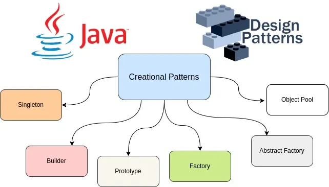

<!-- _class: lead -->

# Advanced Programming
## Design Patterns — Concepts and GoF Patterns

**Instructor:** Ali Najimi  
**Author:** Hossein Masihi  
Sharif University of Technology — Fall 2025

---

# Table of Contents

1. What Are Design Patterns?  
2. Why Patterns Matter  
3. Gang of Four (GoF) Pattern Categories  
4. Examples  
5. Other Modern Patterns  
6. Summary

---

# Design Patterns — Concept

<div class="cols">
<div>

* **Design Patterns** are **reusable solutions** to common software design problems.
* They provide:
  - Shared vocabulary
  - Proven architecture approaches
  - Maintainable and scalable design strategy

> Patterns do not give code — they guide structure and behavior.

</div>
<div>
  <div class="imgbox">

  

  </div>
</div>
</div>

---

# Why Use Design Patterns?

| Benefit | Explanation |
|--------|-------------|
| Reusability | Solutions can apply across projects |
| Maintainability | Clear structure reduces complexity |
| Communication | Common terminology improves teamwork |
| Quality | Prevents reinventing poor solutions |

> Patterns make design intentional — not accidental.

---

# The Gang of Four (GoF) Patterns

* Introduced in the book:  
  **“Design Patterns: Elements of Reusable Object-Oriented Software” (1994)**

Categorized into **3 groups**:

| Category | Purpose |
|---------|---------|
| **Creational** | Object creation management |
| **Structural** | Class and object composition |
| **Behavioral** | Object interaction and responsibility |

---

# Creational Patterns (Examples)

| Pattern | Purpose |
|--------|---------|
| **Singleton** | Only one instance exists globally |
| **Factory Method** | Delegates object creation to subclasses |
| **Builder** | Constructs complex objects step-by-step |

Example — Singleton:

```java
class Database {
    private static Database instance = new Database();
    private Database() {}
    public static Database getInstance() { return instance; }
}
````

---

# Structural Patterns (Examples)

| Pattern       | Purpose                                        |
| ------------- | ---------------------------------------------- |
| **Adapter**   | Convert one interface to another               |
| **Decorator** | Add behavior dynamically                       |
| **Facade**    | Provide a simple interface to a complex system |

Example — Adapter:

```java
interface USBC { void connect(); }
class HDMI {   void plugHDMI() { System.out.println("HDMI connected"); }  }
class HDMItoUSBAdapter implements USBC {
    private HDMI hdmi = new HDMI();
    public void connect() { hdmi.plugHDMI(); }
}
```

---

# Behavioral Patterns (Examples)

| Pattern      | Purpose                            |
| ------------ | ---------------------------------- |
| **Strategy** | Select algorithm at runtime        |
| **Observer** | Notify dependents automatically    |
| **Command**  | Encapsulate a request as an object |

Example — Strategy:

```java
interface SortStrategy { void sort(int[] data); }
class QuickSort implements SortStrategy {   public void sort(int[] data) { /* ... */ }  }
class SortContext {
    private SortStrategy strategy;
    SortContext(SortStrategy strategy) { this.strategy = strategy; }
    void execute(int[] data) { strategy.sort(data); }
}
```

---

# Other Useful Patterns (Beyond GoF)

| Pattern                       | Domain                           |
| ----------------------------- | -------------------------------- |
| **MVC / MVVM**                | UI architecture                  |
| **Repository**                | Data layer abstraction           |
| **Dependency Injection**      | Manage object dependencies       |
| **Event-Driven Architecture** | Distributed system communication |

> Modern software combines GoF patterns with architectural patterns.

---

# Summary

| Concept         | Description                                    |
| --------------- | ---------------------------------------------- |
| Design Patterns | Reusable solutions to common design issues     |
| GoF Categories  | Creational, Structural, Behavioral             |
| Value           | Improves maintainability, quality, and clarity |
| Modern Patterns | Apply at architectural system scale            |

> Good engineers **recognize**, **adapt**, and **apply** patterns.

---

<!-- _class: lead -->

# Thank You!

<div class="">
<div>
<p class="pill">Design Patterns — Core Understanding</p>
</div>
<div class="imgbox">


</div>
</div>

**Sharif University of Technology — Advanced Programming — Fall 2025**

