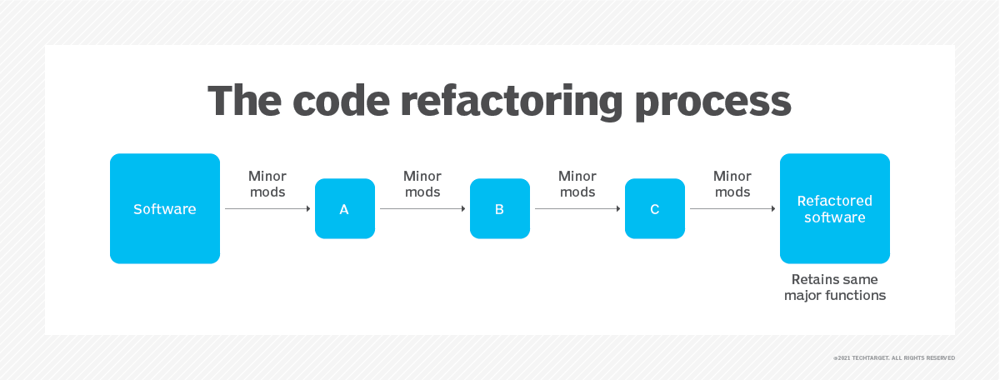
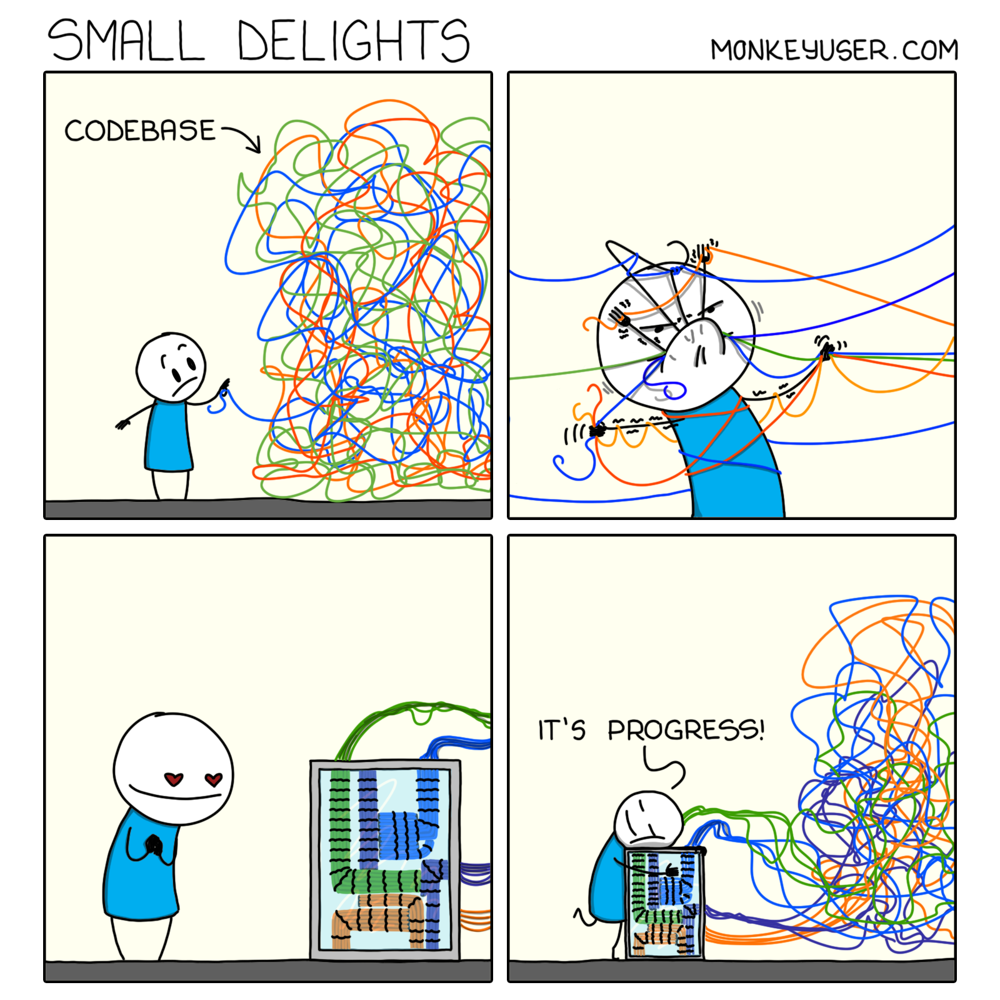
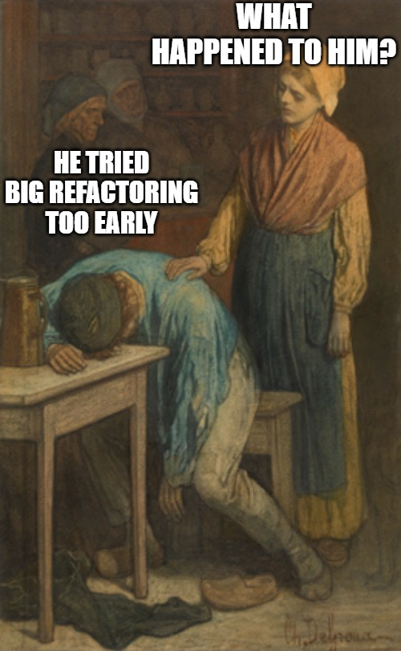
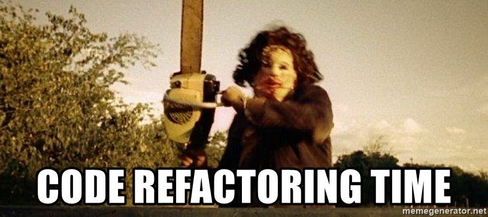
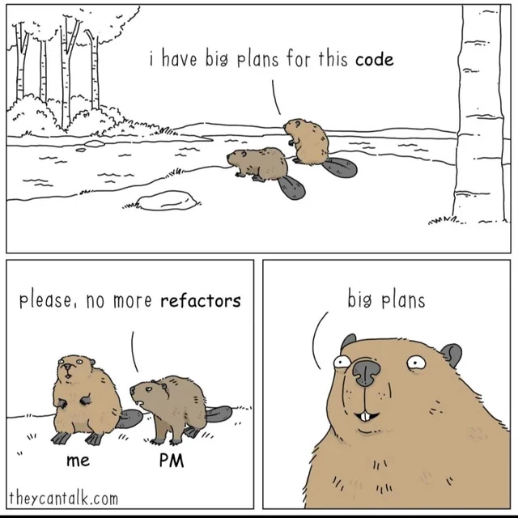

<!-- _class: lead -->

# Advanced Programming
## Refactoring — Improving Code Quality

**Instructor:** Ali Najimi  
**Author:** Hossein Masihi
**Department of Computer Engineering**  
**Sharif University of Technology**  
**Fall 2025**

---

# Table of Contents

1. Refactoring — Concept  
2. Clean Code Principles  
3. Recognizing Bad Code Smells  
4. Refactoring Techniques (Patterns)  
5. Example  
6. Summary


---

  <div class="imgbox">

  
  </div>

---

# Refactoring — Concept

<div class="cols">
<div>

* **Refactoring** is the process of **improving internal code structure**  
  *without changing external behavior*.
* Goal:
  - Cleaner structure
  - Better readability
  - Easier maintenance
  - Fewer bugs over time

> "Refactoring is improving the design after the code is written." — Martin Fowler

</div>
<div>
  <div class="imgbox">

  
  </div>
</div>
</div>

---

# Clean Code Principles

<div class="cols">
<div>

| Principle | Meaning |
|---------|---------|
| Readability | Code should be easy to understand |
| Single Responsibility | Each unit has one purpose |
| Small Functions | Functions should do *one thing* |
| Naming Matters | Clear, intention-revealing names |
| No Duplication | Reuse logic instead of copy-paste |

> Code is read **more often** than it is written.

</div>
<div>
  <div class="imgbox">

  
  </div>
</div>
</div>
---

# Bad Code — Code Smells

| Smell | Description |
|------|-------------|
| Long Method | Too much logic in one function |
| Large Class | Too many responsibilities |
| Magic Numbers | Unclear hardcoded values |
| Duplicated Code | Same logic in multiple places |
| Feature Envy | One class uses another class’s data excessively |

> Code smells indicate **where** refactoring is needed.

---

# Example of Bad Code (Before Refactoring)

```java
double calculateTotal(double price, double tax) {
    double t = price * tax;
    System.out.println("Total: " + (price + t));
    return price + t;
}
````

Problems:

* Mixed **calculation** and **printing**
* Ambiguous variable naming

---


  <div class="imgbox">

  
  </div>

---
# After Refactoring

```java
double calculateTotal(double price, double tax) {
    return price + taxAmount(price, tax);
}

double taxAmount(double price, double tax) {
    return price * tax;
}
```

* Clear naming
* Separated responsibilities
* Reusable logic

> Cleaner code → easier testing and extension.

---

# Common Refactoring Patterns

| Pattern                                | Purpose                               |
| -------------------------------------- | ------------------------------------- |
| **Extract Method**                     | Split large methods into smaller ones |
| **Rename Variable**                    | Improve meaning of identifiers        |
| **Extract Class**                      | Move responsibilities into new class  |
| **Inline Method**                      | Remove unnecessary methods            |
| **Replace Magic Number with Constant** | Improve clarity and configurability   |

---

# Refactoring + Testing

* Refactor **only when tests exist**
* Unit tests guarantee behavior stays the same
* Refactoring should **not change output**

> Testing + Refactoring = Safe Continuous Improvement

---

# Summary

| Concept              | Key Idea                                             |
| -------------------- | ---------------------------------------------------- |
| Refactoring          | Improve internal structure without changing behavior |
| Clean Code           | Readable, simple, intention-revealing                |
| Code Smells          | Signals for needed improvement                       |
| Refactoring Patterns | Systematic ways to improve design                    |

> Great developers continually refactor — not just write code.

---

<!-- _class: lead -->

# Thank You!

<div class="cols">
<div>


<p class="pill">Refactoring — Clean Code for the Future</p>
</div>
<div class="imgbox">


</div>
</div>

**Sharif University of Technology — Advanced Programming — Fall 2025**


