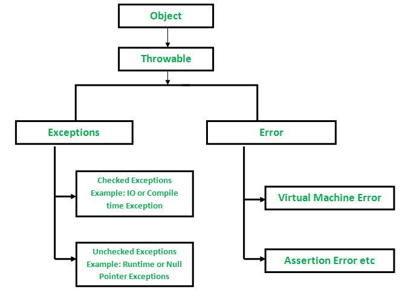
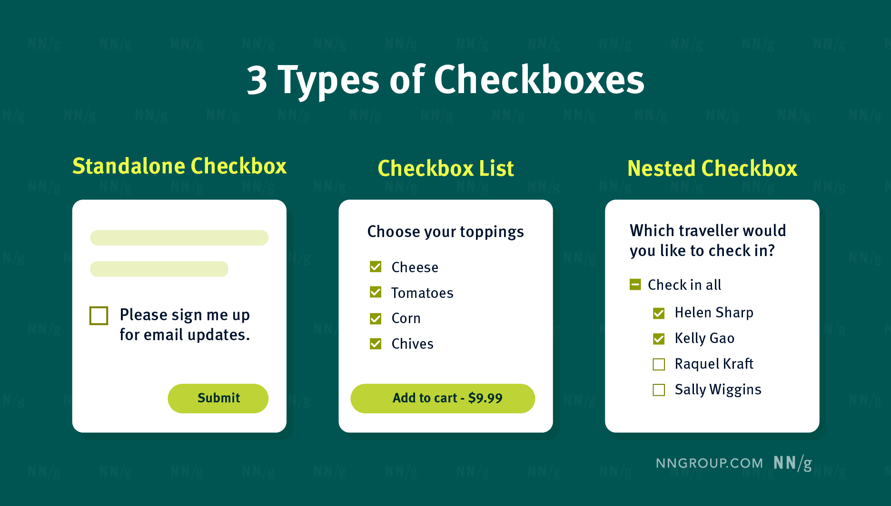
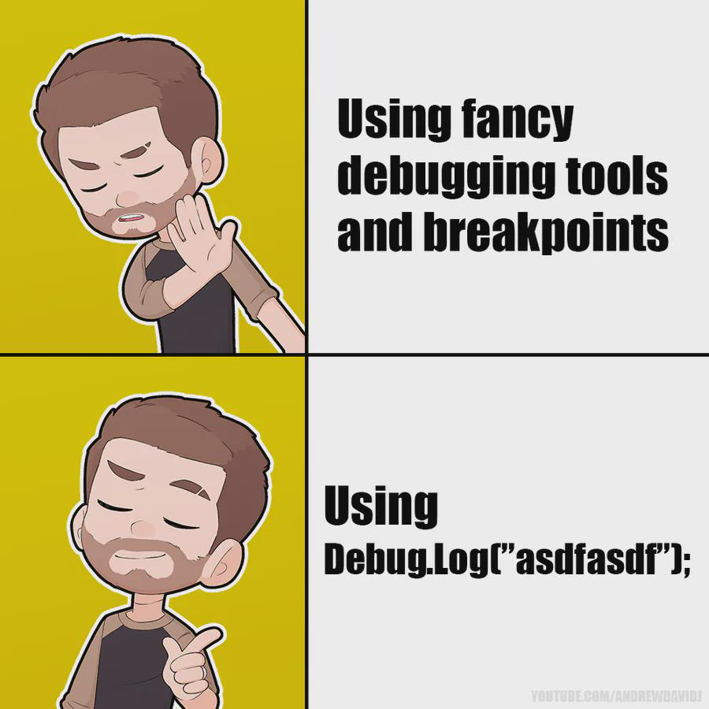
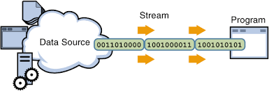

<!-- _class: lead -->

# Advanced Programming
## Error Handling & Exception Management in Java

**Instructor:** Ali Najimi  
**Author:** Hossein Masihi  
Sharif University of Technology — Fall 2025

---

# Table of Contents

1. Traditional Error Management  
2. Exception Handling in Java  
3. `try` / `catch` / `finally`  
4. Checked vs Unchecked Exceptions  
5. Real-World Usage Examples  
6. Visual Comparison Diagrams  
7. Developer Humor (Break Slides)  
8. Summary

---

# Before Exceptions — Traditional Error Management

```java
int divide(int a, int b) {
    if (b == 0) return -1; // error signal
    return a / b;
}
````

Problems:

* Magic error values (`-1`, `null`, etc.)
* Hard to detect real failure vs result
* No call stack → debugging is painful

> Traditional error codes are weak and ambiguous.

---

# Exception Handling in Java

```java
try {
    // code that may fail
} catch (Exception e) {
    // recovery / fallback
}
```

Benefits:

* Clear failure path
* Stack trace preserved
* Encourages predictable failure patterns

---

# `try` / `catch` / `finally`

```java
try {
    FileReader f = new FileReader("data.txt");
} catch (FileNotFoundException e) {
    System.out.println("File not found");
} finally {
    System.out.println("Cleanup always runs");
}
```

* `finally` always executes (except `System.exit()` / JVM crash).
* Use for **cleanup**: closing files, sockets, DB connections.

---

# Checked vs Unchecked Exceptions

| Type          | Inherits From      | Must Handle? | Root Cause        | Examples                                      |
| ------------- | ------------------ | ------------ | ----------------- | --------------------------------------------- |
| **Checked**   | `Exception`        | **Yes**      | External failures | `IOException`, `SQLException`                 |
| **Unchecked** | `RuntimeException` | No           | Logic bugs        | `NullPointerException`, `ArithmeticException` |

> Checked = environment uncertainty
> Unchecked = programming mistake

---

# Visual Comparison — Checked

<div class="cols">
<div>

**Checked Exceptions**

* Caused by environment (I/O, network)
* Developer must acknowledge the risk
* Encourages recovery strategy

</div>
<div class="imgbox">


</div>
</div>

---

# Visual Comparison — Unchecked


**Unchecked Exceptions**

* Caused by incorrect logic in code
* No forced handling
* Should be solved by fixing logic

---

<div class="imgbox">


</div>

---

# Developer Humor Break
<div class="cols">
<div>

> “It works on my machine.”

```
Translation:
I have absolutely no idea why it doesn't work anywhere else.
```
</div>

<div>

<div class="imgbox">



</div>
</div>

---

# Real-World Example — Checked

<div class="cols">
<div>

```java
void loadConfig() throws IOException {
    FileReader reader = new FileReader("config.json");
    // process...
}
```


* The file may not exist
* Storage may be corrupted
* Permissions may differ

</div>
<div>

<div class="imgbox">




</div>
</div>

---

# Real-World Example — Unchecked

```java
void greet(User user) {
    System.out.println(user.name); // may throw NullPointerException
}
```

Correct approach:

```java
void greet(User user) {
    if (user == null) throw new IllegalArgumentException("User cannot be null");
    System.out.println(user.name);
}
```


---

# Developer Humor Break #2

Developer:

```
No need for error handling, my code cannot fail.
```

Production:

```
Exception: Are you sure about that?
```


---

# Big Picture Flow Diagram

```
      Outside World (Unpredictable)
                  ↓
      +----------------------+
      |  CHECKED EXCEPTION   |
      +----------------------+
        Must handle or declare
```

```
      Developer Logic (Bug)
                  ↓
      +----------------------+
      | UNCHECKED EXCEPTION  |
      +----------------------+
        Fix the code logic
```

---

# Summary

| Concept              | Key Idea                        |
| -------------------- | ------------------------------- |
| Checked Exceptions   | Handle real-world uncertainty   |
| Unchecked Exceptions | Fix broken program logic        |
| `finally`            | Always used for cleanup         |
| Good Practice        | Fail clearly, fail meaningfully |

> Robust software is not only coded — it is **defensively designed**.

---

<!-- _class: lead -->

# Thank You!

**Sharif University of Technology — Advanced Programming — Fall 2025**
