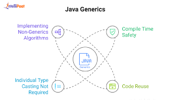
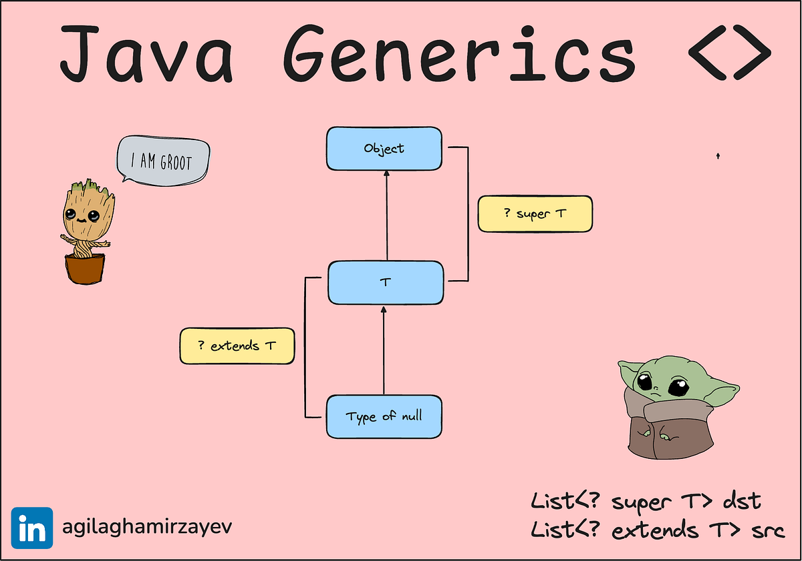

<!-- _class: lead -->

# Advanced Programming
## Generics in Java — Type Safety & Reusability

**Instructor:** Ali Najimi  
**Author:** Hossein Masihi
**Department of Computer Engineering**  
**Sharif University of Technology**  
**Fall 2025**

---

# Table of Contents

1. What Are Generics?  
2. Generic Classes  
3. Generic Methods  
4. Creating Generic Objects  
5. Generics in Inheritance  
6. Summary  

---

# Generics — Concept

<div class="cols">
<div>

* Generics provide **type safety** and **reuse** in class and method definitions.
* They allow defining classes, interfaces, and methods **without specifying exact data types**.
* Prevents runtime errors like `ClassCastException`.

> Generics enable **compile-time type checking**.

</div>
<div>
  <div class="imgbox">

  
  </div>
</div>
</div>

---

# Generic Class Example

```java
class Box<T> {
    private T value;

    public void set(T value) { this.value = value; }
    public T get() { return value; }
}
````

```java
Box<Integer> intBox = new Box<>();
intBox.set(42);

Box<String> strBox = new Box<>();
strBox.set("Sharif");
```

> `T` is a type placeholder. Replaced when object is created.

---

# Generic Method Example

```java
class Utils {
    public static <T> void print(T item) {
        System.out.println(item);
    }
}
```

```java
Utils.print(100);
Utils.print("Sharif");
Utils.print(3.14);
```

> Generic methods define their own type parameter.

---

# Creating Generic Objects

Without Generics (Old Java):

```java
List list = new ArrayList();
list.add("Hello");
list.add(10); // no type safety
```

With Generics:

```java
List<String> list = new ArrayList<>();
list.add("Hello");
// list.add(10); // compile-time error
```

> Generics **prevent invalid types** from being inserted.

---

# Generics in Inheritance

* **Generics are not covariant** by default.

```java
List<Object> a;
List<String> b;

// a = b; // Not allowed
```

But:

```java
List<? extends Number> nums;
nums = new ArrayList<Integer>(); // OK
nums = new ArrayList<Double>();  // OK
```

> Use **wildcards (`? extends`, `? super`)** to allow controlled flexibility.

---

# Bounded Type Parameters

```java
class Calculator<T extends Number> {
    double square(T n) {
        return n.doubleValue() * n.doubleValue();
    }
}
```

```java
Calculator<Integer> c1 = new Calculator<>();
Calculator<Double> c2 = new Calculator<>();
```

> Restricts generic types to specific inheritance hierarchies.

---

# Summary

| Concept        | Description                                   |
| -------------- | --------------------------------------------- |
| Generics       | Enable type-safe reusable classes and methods |
| Generic Class  | Uses type placeholders (e.g., `class Box<T>`) |
| Generic Method | Defines `<T>` before return type              |
| Wildcards      | Allow controlled flexibility in inheritance   |
| Benefit        | Eliminates runtime casting errors             |

> Generics make code **safer, cleaner, and more reusable**.

---

<!-- _class: lead -->

# Thank You!

<div class="cols">
<div>
<p class="pill">Generics in Java — Safe and Flexible Abstraction</p>
</div>
<div class="imgbox">


</div>
</div>

**Sharif University of Technology — Advanced Programming — Fall 2025**
