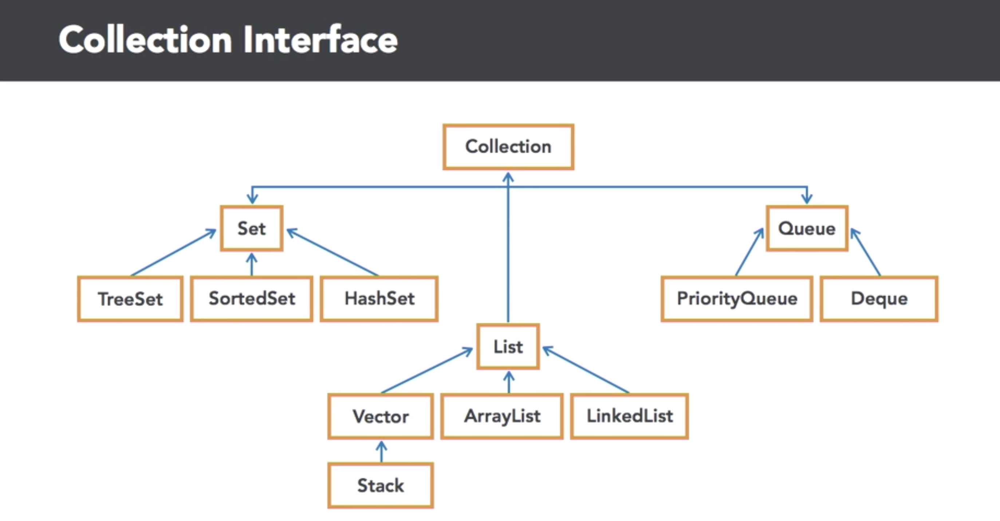
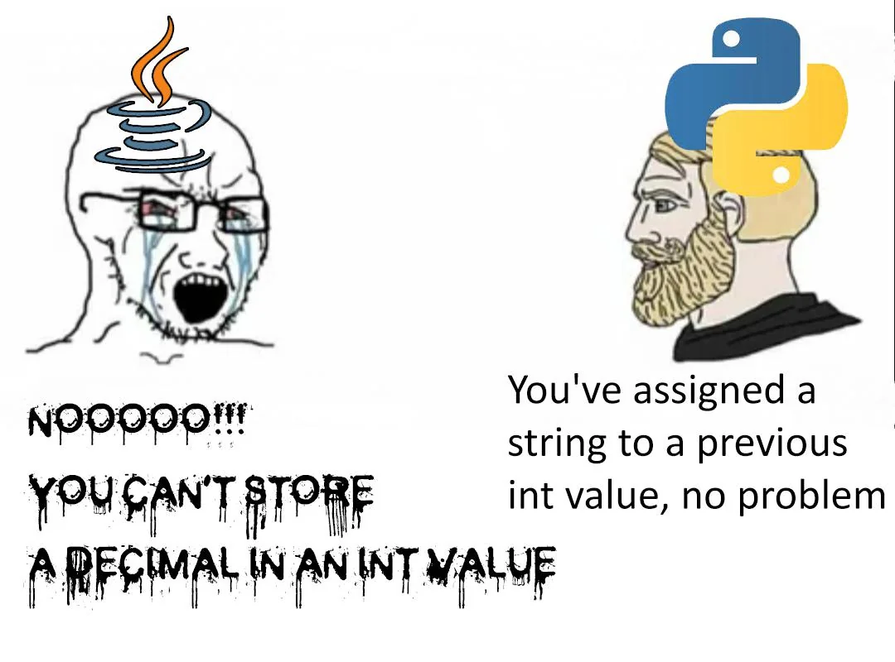

<!-- _class: lead -->

# Advanced Programming
## Containers — Java Data Structures

**Instructor:** Ali Najimi  
**Author:** Hossein Masihi  
Sharif University of Technology — Fall 2025

---

# Table of Contents

1. What Are Containers?  
2. Java Collections Framework  
3. Lists  
4. Sets  
5. Maps  
6. Choosing the Right Data Structure  
7. Summary

---

# Containers — Concept

<div class="cols">
<div>

* A **container** is a data structure that stores and organizes objects.
* Java provides the **Collections Framework**, offering reusable data structures.
* Key Concepts:
  - Storage
  - Access rules
  - Performance characteristics

> Containers impact time complexity, memory use, and app performance.

</div>
<div>
  <div class="imgbox">

  
  </div>
</div>
</div>

---

# Java Collections Framework Overview

| Interface | Implementations | Key Feature |
|----------|----------------|-------------|
| **List** | ArrayList, LinkedList | Ordered, allows duplicates |
| **Set** | HashSet, TreeSet | No duplicates |
| **Map** | HashMap, TreeMap | Key-value storage |
| **Queue** | PriorityQueue, ArrayDeque | FIFO ordering |

---

# List — Ordered Collection

```java
List<String> names = new ArrayList<>();
names.add("Ali");
names.add("Hossein");
names.add("Ali"); // duplicates allowed
````

Characteristics:

* Maintains **insertion order**
* Allows **indexed access**
* Allows **duplicate elements**

Use when:

* You need **order** and **random access**

---

# Set — Unique Collection

```java
Set<String> ids = new HashSet<>();
ids.add("A1");
ids.add("A1"); // ignored
ids.add("B3");
```

Characteristics:

* **No duplicates**
* No guaranteed order (unless using TreeSet)
* Efficient membership testing

Use when:

* You care about **uniqueness** of stored items

---

# Map — Key-Value Structure

```java
Map<String, Integer> age = new HashMap<>();
age.put("Ali", 21);
age.put("Sara", 20);
age.put("Ali", 25); // overwrites value
```

Characteristics:

* Fast lookup by **key**
* Keys are unique
* Values may repeat

Use when:

* You need **associative lookup** (dictionary behavior)

---

# Choosing the Right Container

| Requirement            | Best Choice  |
| ---------------------- | ------------ |
| Fast Random Access     | `ArrayList`  |
| Frequent Insert/Delete | `LinkedList` |
| Unique Elements        | `HashSet`    |
| Sorted Elements        | `TreeSet`    |
| Key-Value Lookup       | `HashMap`    |
| Sorted Key-Value       | `TreeMap`    |

> The right container reduces complexity dramatically.

---

# Example Comparison

```java
List<Integer> list = new ArrayList<>();
Set<Integer> set = new HashSet<>();
Map<String, Integer> map = new HashMap<>();
```

| Feature            | List | Set | Map |
| ------------------ | ---- | --- | --- |
| Stores duplicates  | Yes  | No  | N/A |
| Indexed access     | Yes  | No  | No  |
| Key-value behavior | No   | No  | Yes |

---

# Summary

| Concept    | Description                                |
| ---------- | ------------------------------------------ |
| Containers | Structures for storing and organizing data |
| Lists      | Ordered, allow duplicates                  |
| Sets       | Unique elements only                       |
| Maps       | Key-value associations                     |
| Choosing   | Depends on behavior and performance needs  |

> Strong programming requires **choosing the right data structure**.

---

<!-- _class: lead -->

# Thank You!

<div class="cols">
<div>
<p class="pill">Java Data Structures — Core Containers</p>
</div>
<div class="imgbox">


</div>
</div>

**Sharif University of Technology — Advanced Programming — Fall 2025**
