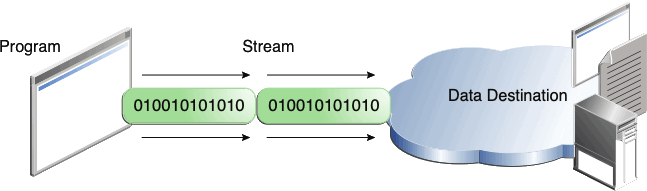
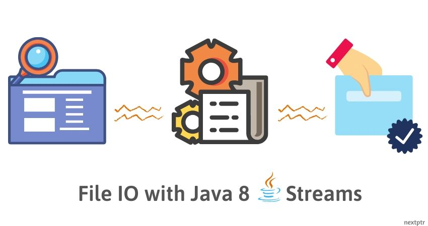
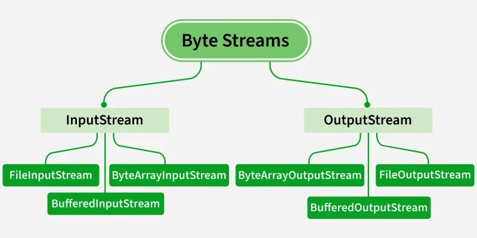
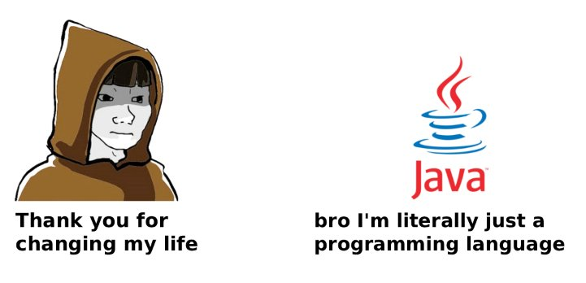

<!-- _class: lead -->

# Advanced Programming
## File, Stream & Serialization in Java

**Instructor:** Ali Najimi  
**Author:** Hossein Masihi  
Sharif University of Technology — Fall 2025

---

# Table of Contents

1. What Are Streams?  
2. Input & Output in Java  
3. Reading & Writing Files  
4. Byte Streams vs Character Streams  
5. Serialization  
6. Summary

---

# Streams — Concept

<div class="cols">
<div>

* A **stream** is a flow of data.
* Java I/O works through **streams**:
  - InputStream → read data
  - OutputStream → write data
* Streams are **sequential** data channels.

> Everything in Java I/O is built around streams.

</div>
<div>
  <div class="imgbox">

  
  </div>
</div>
</div>

---

  <div class="imgbox">

  
  </div>

---

# Input & Output Overview

| Type | Parent Class | Purpose |
|------|--------------|---------|
| **Byte Stream** | `InputStream`, `OutputStream` | Handles raw binary data |
| **Character Stream** | `Reader`, `Writer` | Handles text characters with encoding |

```java
InputStream in = new FileInputStream("data.bin");
Reader reader = new FileReader("data.txt");
````

---

# Reading a File (Character Stream)

```java
try (BufferedReader br = new BufferedReader(new FileReader("input.txt"))) {
    String line;
    while ((line = br.readLine()) != null) {
        System.out.println(line);
    }
}
```

* `BufferedReader` improves efficiency
* `try-with-resources` auto-closes the file

---

# Writing to a File

```java
try (BufferedWriter bw = new BufferedWriter(new FileWriter("output.txt"))) {
    bw.write("Sharif University");
}
```

* Writing happens in **text form**
* Buffered writers reduce disk operations

---

# Byte Streams — Handling Raw Data

```java
try (FileInputStream in = new FileInputStream("image.png");
     FileOutputStream out = new FileOutputStream("copy.png")) {

    int data;
    while ((data = in.read()) != -1) {
        out.write(data);
    }
}
```

> Used for images, audio, compiled files, etc.


---

  <div class="imgbox">

  
  </div>

---

# Serialization — Storing Objects

* Serialization converts an **object into a byte stream**
* Allows:

    * Saving objects to disk
    * Sending objects over network

```java
class Student implements Serializable {
    String name;
    int id;
}
```

---

# Writing Serialized Objects

```java
ObjectOutputStream out = new ObjectOutputStream(new FileOutputStream("std.bin"));
out.writeObject(new Student("Ali", 401110891));
out.close();
```

# Reading Serialized Objects

```java
ObjectInputStream in = new ObjectInputStream(new FileInputStream("std.bin"));
Student s = (Student) in.readObject();
in.close();
```

> Requires class to implement `Serializable`.

---

# Summary

| Concept          | Description                                    |
| ---------------- | ---------------------------------------------- |
| Stream           | Sequential data flow                           |
| Byte Stream      | Raw data (binary)                              |
| Character Stream | Encoded text                                   |
| File I/O         | Reading and writing text and binary files      |
| Serialization    | Converting objects → transferable byte streams |

> Mastering I/O is essential for data processing applications.

---

<!-- _class: lead -->

# Thank You!

<div class="cols">
<div>
<p class="pill">Java File & Stream — Practical I/O</p>
</div>
<div class="imgbox">


</div>
</div>

**Sharif University of Technology — Advanced Programming — Fall 2025**
