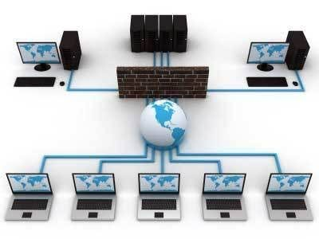
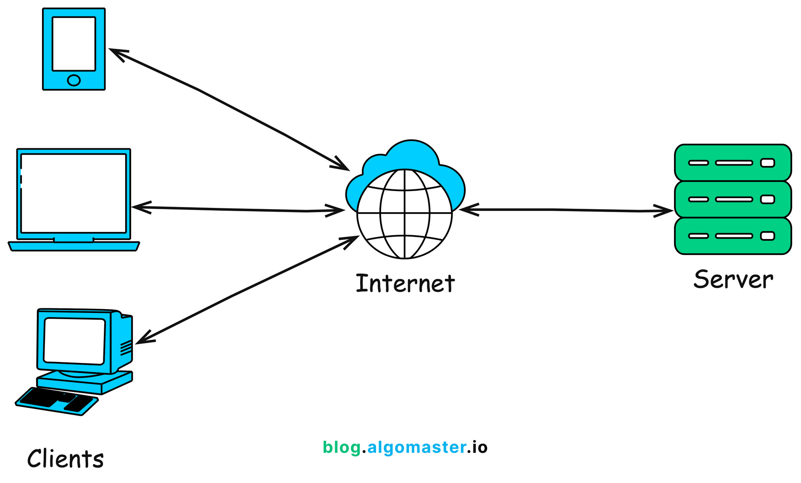

<!-- _class: lead -->

# Advanced Programming
## Networking & Socket Programming

**Instructor:** Ali Najimi  
**Author:** Hossein Masihi  
Sharif University of Technology — Fall 2025

---

# Table of Contents

1. What is Networking?  
2. IP, Ports, and Protocols  
3. Socket Programming Basics  
4. TCP vs UDP  
5. Client-Server Communication Model  
6. Example: Java Socket Server & Client  
7. Summary

---

# Networking — Concept

<div class="cols">
<div>

* **Networking** allows computers to communicate and share data.
* Communication happens through:
  - **IP Address** (identifies device)
  - **Port Number** (identifies application)
  - **Protocol** (rule of communication)

> Networking enables distributed systems and real-time applications.

</div>
<div>
  <div class="imgbox">
  
  </div>
</div>
</div>

---

# TCP vs UDP

| Feature | TCP | UDP |
|--------|-----|-----|
| Reliability | Guaranteed delivery | No delivery guarantee |
| Ordering | Maintains packet order | No ordering |
| Speed | Slower | Faster |
| Use Case | Web, Email, Banking | Streaming, VoIP, Games |

> TCP = Reliable.  
> UDP = Fast.

---

# What is a Socket?

* A **socket** is an endpoint for communication.
* Created on both **client** and **server**.
* The server listens on a **port** waiting for clients.

```

Client <----> Network <----> Server

````

> Sockets enable bidirectional communication.

---

# Client-Server Model

<div class="imgbox">

</div>

* Server waits for requests  
* Client initiates communication  

---

# Example — Simple TCP Server (Java)

```java
import java.net.*;
import java.io.*;

public class Server {
    public static void main(String[] args) throws Exception {
        ServerSocket server = new ServerSocket(5000);
        Socket socket = server.accept();
        BufferedReader in = new BufferedReader(new InputStreamReader(socket.getInputStream()));
        System.out.println("Client says: " + in.readLine());
        server.close();
    }
}
````

---

# Example — Simple TCP Client (Java)

```java
import java.net.*;
import java.io.*;

public class Client {
    public static void main(String[] args) throws Exception {
        Socket socket = new Socket("localhost", 5000);
        PrintWriter out = new PrintWriter(socket.getOutputStream(), true);
        out.println("Hello Server!");
        socket.close();
    }
}
```

> Client connects → sends → server receives.

---

# Key Design Notes

| Concept               | Importance                     |
| --------------------- | ------------------------------ |
| Blocking I/O          | Calls wait until completion    |
| Multithreading Server | Supports multiple clients      |
| Resource Cleanup      | Always close streams & sockets |
| Protocol Design       | Agree on message format        |

---

# Summary

| Concept       | Description                     |
| ------------- | ------------------------------- |
| Network       | Enables remote communication    |
| Socket        | Endpoint for data transfer      |
| TCP           | Reliable, ordered communication |
| UDP           | Fast, lightweight communication |
| Client/Server | Fundamental interaction model   |

> Sockets enable everything from chat apps to distributed computing.

---

<!-- _class: lead -->

# Thank You!

<div class="cols">
<div>
<p class="pill">Networking & Sockets — Practical Foundations</p>
</div>
<div class="imgbox">

</div>
</div>

**Sharif University of Technology — Advanced Programming — Fall 2025**
