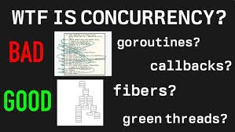
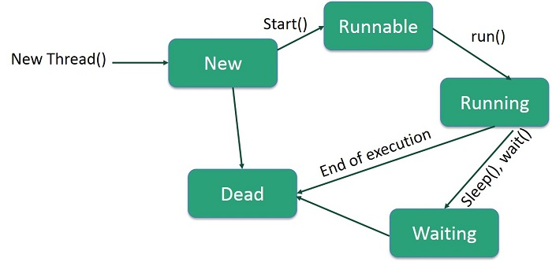

<!-- _class: lead -->

# Advanced Programming
## Concurrency — Multithreading in Java

**Instructor:** Ali Najimi
**Author:** Hossein Masihi
**Department of Computer Engineering**  
**Sharif University of Technology**  
**Fall 2025**

---

<div class="imgbox">


</div>

---
# Concurrency — Concept

* **Concurrency** allows multiple tasks to progress **overlapping in time**.
* In Java, concurrency is primarily achieved using **Threads**.
* Useful for:
  - Parallel computation
  - Responsive UI
  - Server handling multiple clients

```java
class MyThread extends Thread {
    public void run() {System.out.println("Running in parallel!"); }
    }
````

> Concurrency ≠ Parallelism
> (parallelism requires multiple CPU cores)

---

# Creating Threads

### Extending `Thread`

```java
class Worker extends Thread {
    public void run() {
        System.out.println("Thread running");
    }
}
new Worker().start();
```
---

### Implementing `Runnable`

```java
class Worker implements Runnable {
    public void run() {
        System.out.println("Running");
    }
}
new Thread(new Worker()).start();
```

> Always use `start()`, never call `run()` directly.

---

# Thread Life Cycle

| State             | Meaning                        |
| ----------------- | ------------------------------ |
| New               | Thread created but not started |
| Runnable          | Ready to run or running        |
| Blocked / Waiting | Waiting for a resource / event |
| Timed Waiting     | Waiting for a specified time   |
| Terminated        | Execution finished             |

---

<div class="imgbox">
<h1>Thread Lifecycle</h1>



</div>

---

# Synchronization — Why?

Multiple threads accessing shared data simultaneously can cause **race conditions**.

Example of incorrect behavior:

```java
class Counter {
    int value = 0;
    void increment() { value++; }
}
```

Two threads running increment() may **overwrite each other** → wrong results.

---

# Synchronization — Solution

```java
class Counter {
    private int value = 0;

    synchronized void increment() {
        value++;
    }

    synchronized int getValue() {
        return value;
    }
}
```

* `synchronized` ensures **mutual exclusion**.
* Only one thread can run the synchronized method at a time.

> Synchronization prevents **race conditions** but reduces performance.

---

# Critical Section

* A **Critical Section** is code that accesses **shared data**.
* It must be executed **atomically** (one thread at a time).

Identifying critical section:

```java
balance = balance - amount;
```

**If not synchronized → corrupted financial transactions.**

---

**Errors that occur here:**

| Error           | Cause                                       |
| --------------- | ------------------------------------------- |
| Race Condition  | Two threads update shared data at same time |
| Data Corruption | Intermediate state becomes visible          |
| Lost Update     | One write overwrites the other              |

---

# Locks — More Control

```java
import java.util.concurrent.locks.*;

class Account {
    private Lock lock = new ReentrantLock();
    private int balance;

    void withdraw(int amount){
        lock.lock();
        try { balance -= amount; } finally { lock.unlock(); }
    }
}
```

`Lock` provides:

* `tryLock()` → avoid deadlock
* More flexibility than `synchronized`

---

# Deadlock — When Threads Block Each Other

Occurs when two threads wait forever for resources held by each other.

```text
Thread A waits for resource X → held by Thread B
Thread B waits for resource Y → held by Thread A
```

> Avoid holding multiple locks at the same time when possible.

---

# Summary

| Concept           | Key Idea                                   |
| ----------------- | ------------------------------------------ |
| Concurrency       | Overlapping execution of tasks             |
| Thread Life Cycle | States from creation → termination         |
| Synchronization   | Prevents race conditions                   |
| Critical Section  | Code accessing shared data                 |
| Locks             | Give more granular control                 |
| Goal              | Safe and efficient multi-threaded programs |

---

<!-- _class: lead -->

# Thank You!

<div class="cols">
<div>
<p class="pill">Concurrency — Safe Multithreading</p>
</div>
<div class="imgbox">


</div>
</div>

**Sharif University of Technology — Advanced Programming — Fall 2025**
