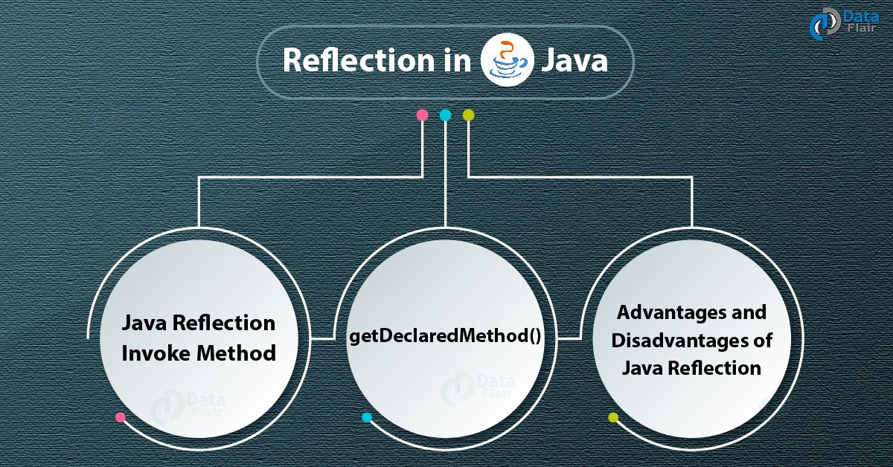

<!-- _class: lead -->

# Advanced Programming
## Reflection & Runtime Type Information

**Instructor:** Ali Najimi  
**Author:** Hossein Masihi
**Department of Computer Engineering**  
**Sharif University of Technology**  
**Fall 2025**

---

# Reflection — Concept

<div class="cols">
<div>

* **Reflection** allows a program to:
  - Inspect classes
  - Examine fields and methods
  - Create objects or call methods **at runtime**
* It treats **classes as data**, not just code.

Use cases:
* Framework development (Spring, Hibernate)
* Serialization
* Dependency Injection
* Testing tools

</div>
<div>
  <div class="imgbox">

  
  </div>
</div>
</div>

---

# RTTI — Runtime Type Information

* RTTI allows the program to know **what type the object actually is at runtime**.
* This is useful when references are stored in **parent type** variables.

```java
Object obj = "Sharif University";
System.out.println(obj.getClass().getName());
````

Output:

```
java.lang.String
```

> **The real object type is determined at runtime, not compile time.**

---

# `getClass()` — Retrieving Class Information

```java
String s = "Sharif";
Class<?> c = s.getClass();
System.out.println(c.getName());
```

* `getClass()` always returns the **actual runtime type**, not the reference type.

---

# Inspecting Class Members via Reflection

```java
class Student {
    public String name;
    private int id;
}
```

```java
Class<?> c = Student.class;
Field[] fields = c.getDeclaredFields();
for (Field f : fields) {
    System.out.println(f.getName());
}
```

Output:

```
name
id
```

---

# Creating Objects Dynamically

```java
Class<?> c = Class.forName("Student");
Object obj = c.getDeclaredConstructor().newInstance();
```

Use carefully:

* Allows **dynamic plugin loading**
* Used in frameworks
* But may reduce clarity & type safety

---

# Invoking Methods via Reflection

```java
Method m = c.getMethod("setName", String.class);
m.invoke(obj, "Ali");
```

**Where Errors Occur:**

| Exception                   | Meaning                          |
| --------------------------- | -------------------------------- |
| `ClassNotFoundException`    | Class name string incorrect      |
| `NoSuchMethodException`     | Method signature doesn't exist   |
| `IllegalAccessException`    | Attempt to access private method |
| `InvocationTargetException` | Method itself threw an exception |

> Reflection is powerful but fragile — always validate names & accessibility.

---

# Reflection — Pros & Cons

| Pros                           | Cons                          |
| ------------------------------ | ----------------------------- |
| Enables dynamic frameworks     | Less performance (slow)       |
| Can work with unknown classes  | Breaks encapsulation          |
| Useful for debugging & testing | Harder to maintain & refactor |

> Use Reflection **when necessary** — not as a default design choice.

---

# Summary

| Concept                | Key Idea                               |
| ---------------------- | -------------------------------------- |
| Reflection             | Inspect and modify program at runtime  |
| RTTI                   | Actual object type is known at runtime |
| `getClass()`           | Returns real object class              |
| Powerful but Dangerous | Should be used with caution            |

---

<!-- _class: lead -->

# Thank You!

<div class="cols">
<div>
<p class="pill">Reflection & RTTI — Runtime Introspection</p>
</div>
<div class="imgbox">


</div>
</div>

**Sharif University of Technology — Advanced Programming — Fall 2025**
